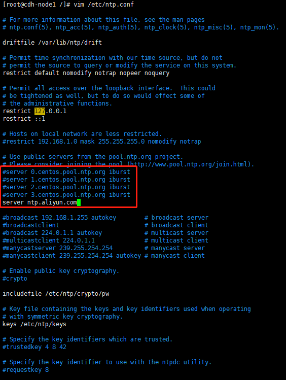
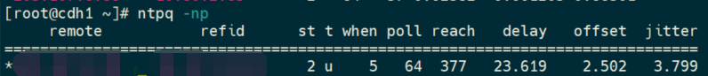

# NTP 服务

ntpd（Network Time Protocol daemon）是 Linux 操作系统的一个守护进程，用于校正本地系统与时钟源服务器之前的时间，完整的实现了 NTP 协议。ntpd 与 ntpdate 的区别是 ntpd 是步进式的逐渐校正时间，不会出现时间跳变，而 ntpdate 是断点更新。

## 安装 ntpd

执行如下命令，判断是否安装 ntpd

```bash
rpm -qa | grep ntp
```

如果未安装 ntpd，执行如下命令进行安装：

```bash
yum -y install ntp
```

## NTP 服务端配置

```bash
vim /etc/ntp.conf

## 注释掉同步服务器
#server 0.centos.pool.ntp.org iburst
#server 1.centos.pool.ntp.org iburst
#server 2.centos.pool.ntp.org iburst
#server 3.centos.pool.ntp.org iburst
## 推荐选用阿里云作为集群服务端的同步服务器
server ntp.aliyun.com
```



## NTP 客户端配置

```bash
vim /etc/ntp.conf

## 直接使用上面配置的NTP服务端作为同步时钟的基准服务器，如服务端所在服务器的主机名为 cdh1
server cdh1
```

## NTP 服务启动并配置开机自启

```bash
systemctl start ntpd.service
systemctl enable ntpd.service
```

注意：需要先启动服务端，之后再启动客户端

## 强制执行同步时间

```bash
ntpstat
ntpdc -c loopinfo
ntpq -p
```

## 其他



- st：越小证明时间越精确
- when：多少秒前曾经同步过时间
- poll：同步周期
- reach：已同步次数
- delay：网络延迟
- offset：时间补偿