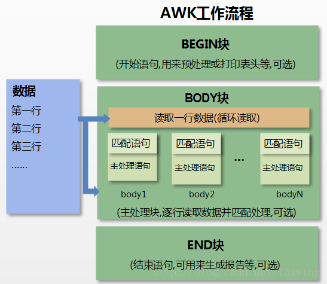

# awk

> awk 是一种处理文本文件的语言，是一个强大的文本分析工具。
>
> awk 是把文件逐行的读入，以指定分隔符将每行内容进行分割，再对分割的部分进行各种分析处理。

**语法**

```sh
# 在 awk 中，文件的每一行中，由域分隔符分开的每一项称为一个域。通常，在不设置 -F 域分隔符的情况下，默认的域分隔符是空格。
awk [选项参数] 'script' file(s)

awk [选项参数] -f scriptfile file(s)
```

> **注意**：在 awk 中 script 只能使用单引号(`''`) 进行包裹

## **选项参数**

| 参数                                                | 描述                                                                      |
| --------------------------------------------------- | ------------------------------------------------------------------------- |
| `-F fs` or `--field-separator=fs`                   | 指定输入文件折分隔符，fs 是一个字符串或者是一个正则表达式                 |
| `-v var=value` or `--asign=var=value`               | 赋值一个用户定义变量                                                      |
| `-f scripfile` or `--file=scriptfile`               | 从脚本文件中读取 awk 命令                                                 |
| `-mf nnn`                                           | 限制分配给 nnn 的最大块数目。该功能是 awk 的扩展功能，在标准 awk 中不适用 |
| `-mr nnn`                                           | 限制记录的最大数目。该功能是 awk 的扩展功能，在标准 awk 中不适用          |
| `-W compact` or `--compat`                          | 在兼容模式下运行awk                                                       |
| `-W traditional` or `--traditional`                 | 同上                                                                      |
| `-W copyleft` or `--copyleft`                       | 打印简短的版权信息                                                        |
| `-W copyright` or `--copyright`                     | 同上                                                                      |
| `-W help` or `--help`                               | 打印全部awk选项和每个选项的简短说明                                       |
| `-W usage` or `--usage`                             | 同上                                                                      |
| `-W lint` or `--lint`                               | 打印不能向传统unix平台移植的结构的警告                                    |
| `-W lint-old` or `--lint-old`                       | 打印关于不能向传统unix平台移植的结构的警告                                |
| `-W posix`                                          | 打开兼容模式                                                              |
| `-W re-interval` or `--re-inerval`                  | 允许间隔正则表达式的使用                                                  |
| `-W source program-text` or `--source program-text` | 使用 program-text 作为源代码，可与-f命令混用                              |
| `-W version` or `--version`                         | 打印 bug 报告信息的版本                                                   |

## **内建变量**

| 变量        | 描述                                                   |
| ----------- | ------------------------------------------------------ |
| `$n`        | 当前记录的第 n 个字段，索引从 1 开始，字段间由 FS 分隔 |
| `$0`        | 完整的输入记录                                         |
| ARGC        | 命令行参数的数目                                       |
| ARGIND      | 命令行中当前文件的位置(从 0 开始算)                    |
| ARGV        | 包含命令行参数的数组                                   |
| CONVFMT     | 数字转换格式(默认值为 `%.6g` )                         |
| ENVIRON     | 环境变量关联数组                                       |
| ERRNO       | 最后一个系统错误的描述                                 |
| FIELDWIDTHS | 字段宽度列表(用空格键分隔)                             |
| FILENAME    | 当前文件名                                             |
| FNR         | 各文件分别计数的行号                                   |
| FS          | 字段分隔符(默认是任何空格)                             |
| IGNORECASE  | 如果为真，则进行忽略大小写的匹配                       |
| NF          | 一条记录的字段的数目                                   |
| NR          | 已经读出的记录数，就是行号，从 1 开始                  |
| OFMT        | 数字的输出格式(默认值是 `%.6g`)                        |
| OFS         | 输出字段分隔符，默认值与输入字段分隔符一致             |
| ORS         | 输出记录分隔符(默认值是一个换行符)                     |
| RLENGTH     | 由 match 函数所匹配的字符串的长度                      |
| RS          | 记录分隔符(默认是一个换行符)                           |
| RSTART      | 由 match 函数所匹配的字符串的第一个位置                |
| SUBSEP      | 数组下标分隔符(默认值是 `/034`)                        |

## **脚本\[script\]**

*BEGIN*

```sh
BEGIN{ 执行开始前的语句 }
```

*END*

```sh
END { 处理完所有的行后要执行的语句 }
```

*示例*

```sh
awk 'BEGIN{printf "%4s %4s %4s %4s %4s %4s %4s %4s %4s\n","FILENAME","ARGC","FNR","FS","NF","NR","OFS","ORS","RS";printf "---------------------------------------------\n"} {printf "%4s %4s %4s %4s %4s %4s %4s %4s %4s\n",FILENAME,ARGC,FNR,FS,NF,NR,OFS,ORS,RS}'  log.txt

# 忽略大小写
awk 'BEGIN{IGNORECASE=1} /this/' log.txt
```

## **示例**

*使用正则，字符串匹配*

```sh
# 输出包含 "re" 的行
awk '/re/ ' log.txt

# 输出第二列包含 "th"，并打印第二列与第四列
awk '$2 ~ /th/ {print $2,$4}' log.txt
```

## 工作原理

awk 工作流程可分为三个部分：

1. 读输入文件之前执行的代码段（由 BEGIN 关键字标识）。
2. 主循环执行输入文件的代码段。
3. 读输入文件之后的代码段（由 END 关键字标识）

**命令结构**

```sh
awk 'BEGIN{ commands } pattern{ commands } END{ commands }'
```

**步骤详解**



1. 通过关键字 BEGIN 执行 BEGIN 块的内容，即 BEGIN 后花括号 {} 的内容；
2. 完成 BEGIN 块的执行，开始执行 body 块；
3. 读入有 \n 换行符分割的记录；
4. 将记录按指定的域分隔符划分域，填充域，$0 则表示所有域(即一行内容)，$1 表示第一个域，$n 表示第 n 个域；
5. 依次执行各 BODY 块，pattern 部分匹配该行内容成功后，才会执行 awk-commands 的内容；
6. 循环读取并执行各行直到文件结束，完成body块执行；
7. 开始 END 块执行，END 块可以输出最终结果。