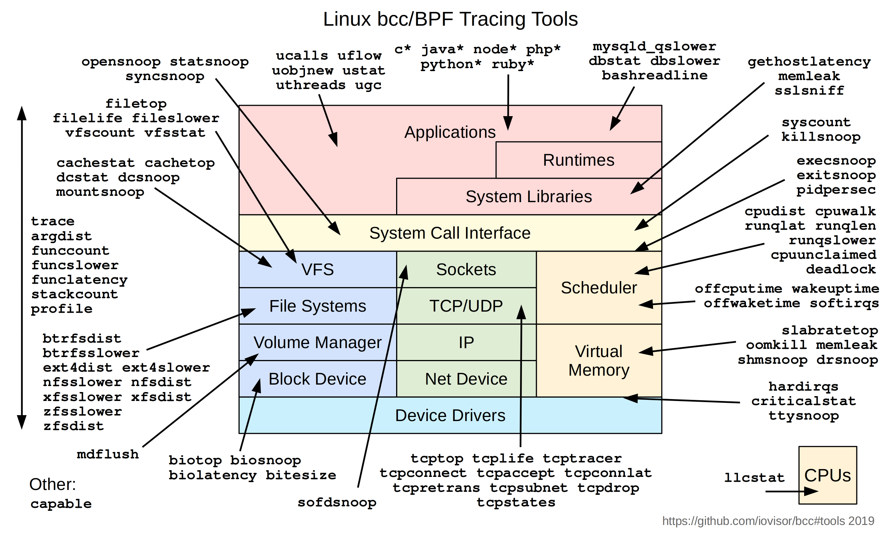

# BCC

> BCC（[iovisor/bcc](https://github.com/iovisor/bcc)）是 BPF Compiler Collection 的缩写，BCC 旨在针对 eBPF/BPF 开发困难的问题，从工程上简化 BPF 的开发而提供的一系列工具链和开发包。
>
> 该项目是一个 python 库， 包含了完整的编写、编译、和加载 BPF 程序的工具链，以及用于调试和诊断性能问题的工具。
> 
> BCC 支持多种语言的调用，但最终都是通过 LLVM 编译器编译成 kernel 的 binary。

**bcc 实现的相关工具**



## 安装

### CentOS7

```sh
yum install -y bcc-tools
```

安装完成后，bcc 工具会放到 `/usr/share/bcc/tools` 目录中。