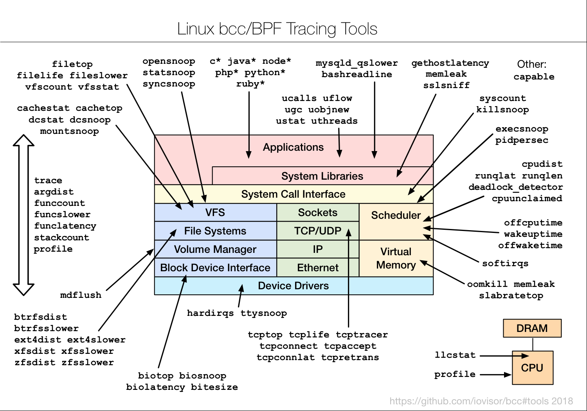
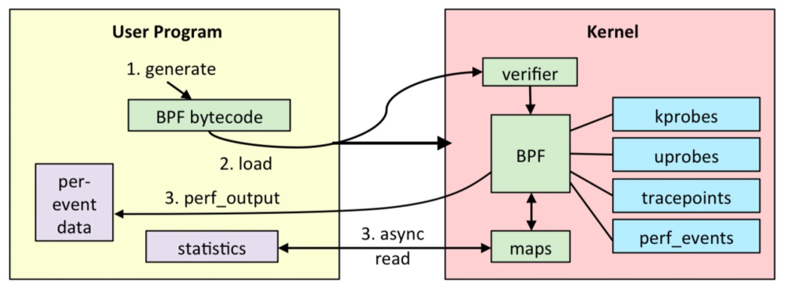

# eBPF

<!--  -->

> eBPF 是一个运行在 kernel 中的虚拟机，可以执行自己的指令集合，抽象上基于一组 Map 来进行存取数据，提供了安全性的检查和限制。
>
> eBPF <!-- 是一种在 Linux 内核上运行的强大网络和性能分析工具，它--> 为开发者提供了在内核运行时动态加载、更新和运行用户定义代码的能力。这使得开发者可以实现高效、安全的内核级别的网络监控、性能分析和故障排查等功能。

## 使用

**步骤**

1. 开发 eBPF 程序代码
2. 使用 LLVM 将 eBPF 程序编译成 BPF 字节码
3. 通过 bpf 系统调用，将 BPF 字节码加载到内核
4. 内核验证并运行 BPF 字节码，并把相应的状态保存到 BPF 映射中
5. 用户程序通过 BPF 映射查询 BPF 字节码的运行状态

eBPF 程序主要由两部分构成：内核态部分和用户态部分。内核态部分包含 eBPF 程序的实际逻辑，用户态部分负责加载、运行和监控内核态程序。

## `libbpf` 库

> eBPF 社区将 `bpf()` 等原始的系统调用进行了初步地封装，给出了 `libbpf` 库。这些库会包含将字节码加载到内核中的函数以及一些其他的关键函数。在 Linux 的源码包的 `samples/bpf/` 目录下，有大量 Linux 提供的基于 libbpf 的 eBPF 样例代码。

