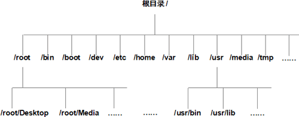

# 文件和目录管理

在 Linux 操作系统中，所有的文件和目录都被组织成以一个根节点 `/` 开始的倒置的树状结构。

注意：目录名和文件名都是区分大小写的。

在文件系统中，有两个特殊的目录，一个是用户所在的工作目录，即当前目录，可用一个点 `.` 表示；另一个是当前目录的上一层目录，也叫父目录，用两个点 `..` 表示。

[文件（目录）命名规则](文件目录命名规则.md ':include')

[切换目录](切换目录.md ':include')

[显示当前工作目录](显示当前工作目录.md ':include')

[查看目录下文件](查看目录下文件.md ':include')

[创建目录](创建目录.md ':include')

[创建文件及修改文件时间戳](创建文件及修改文件时间戳.md ':include')

[复制文件和目录](复制文件和目录.md ':include')

[删除文件和目录](删除文件和目录.md ':include')

[移动或重命名文件和目录](移动或重命名文件和目录.md ':include')