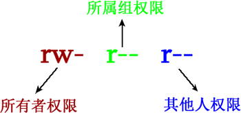

# 权限管理

Linux 系统，最常见的文件权限有 3 种，即对文件的读（用 r 表示）、写（用 w 表示）和执行（用 x 表示，针对可执行文件或目录）权限。在 Linux 系统中，每个文件都明确规定了不同身份用户的访问权限，通过 ls 命令即可看到。

在文件的权限位有 9 位，每 3 个为一组，代表的含义如下所示：

[修改文件和目录的所有者和所属组](修改文件和目录的所有者和所属组.md ':include')

[修改文件或目录的权限](修改文件或目录的权限.md ':include')