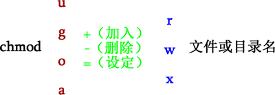

## `chmod` 命令：修改文件或目录的权限

chmod 命令设定文件权限的方式有 2 种，分别可以使用数字或者符号来进行权限的变更。

### chmod 命令使用数字修改文件权限

在 Linux 系统中，可以使用数字代表各个权限，各个权限与数字的对应关系如下：

```
r --> 4
w --> 2
x --> 1
```

通过将 3 个权限对应的数字累加，最终得到的值就可作为每种用户所具有的权限。

**示例** `rwxrw-r-x` 这种权限，所有者、所属组和其他人分别对应的权限值为：

```
所有者=rwx=4+2+1=7
所属组=rw-=4+2=6
其他人=r-x=4+1=5
```

所以，此权限对应的权限值就是 765。

使用数字修改文件权限的 chmod 命令基本格式为：

```bash
[root@localhost ~]# chmod [-R] 权限值 文件名
```

-R（注意是大写）选项表示连同子目录中的所有文件，也都修改设定的权限。

### chmod命令使用字母修改文件权限

既然文件的基本权限就是 3 种用户身份（所有者、所属组和其他人）搭配 3 种权限（rwx），chmod 命令中用 u、g、o 分别代表 3 种身份，还用 a 表示全部的身份（all 的缩写）。另外，chmod 命令仍使用 r、w、x 分别表示读、写、执行权限。

使用字母修改文件权限的 chmod 命令，其基本格式如下图所示。



示例：

```bash
# 设定权限
chmod u=rwx,go=rx .bashrc
# 新增权限
chmod a+w .bashrc
```