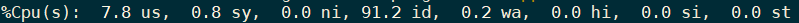
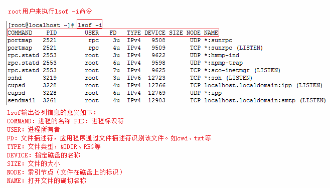

# 系统监控

## free

> 显示当前系统未使用的和已使用的内存数目，还可以显示被内核使用的内存缓冲区

**命令参数**

|      选项       | 描述                         |
|:---------------:|----------------------------|
|      `-b`       | 以Byte为单位显示内存使用情况 |
|      `-k`       | 以KB为单位显示内存使用情况   |
|      `-m`       | 以MB为单位显示内存使用情况   |
|      `-o`       | 不显示缓冲区调节列           |
| `-s <间隔秒数>` | 持续观察内存使用状况         |
|      `-t`       | 显示内存总和列               |

**使用**


|      选项      | 描述                                                                              |
|:--------------:|---------------------------------------------------------------------------------|
|  \[Mem\]total  | 表示物理内存总量                                                                  |
|  \[Mem\]used   | 表示总计分配给缓存（包含buffers 与cache ）使用的数量，但其中可能部分缓存并未实际使用 |
|  \[Mem\]free   | 未被分配的内存                                                                    |
| \[Mem\]shared  | 共享内存，一般系统不会用到，这里也不讨论                                            |
| \[Mem\]buffers | 系统分配但未被使用的buffers 数量                                                  |
| \[Mem\]cached  | 系统分配但未被使用的cache 数量                                                    |
|  \[Swap\]used  | 实际使用的buffers 与cache 总量，也是实际使用的内存总量                             |
|  \[Swap\]free  | 未被使用的buffers 与cache 和未被分配的内存之和，这就是系统当前实际可用内存         |

## df

> 显示磁盘分区上的可使用的磁盘空间。默认显示单位为 KB。可以利用该命令来获取硬盘被占用了多少空间，目前还剩下多少空间等信息。

|                         选项                         | 描述                                                              |
|:----------------------------------------------------:|-----------------------------------------------------------------|
|                   `-a` 或 `--all`                    | 包含全部的文件系统                                                |
|              `--block-size=<区块大小>`               | 以指定的区块大小来显示区块数目                                    |
|              `-h` 或 `--human-readable`              | 以可读性较高的方式来显示信息；                                     |
|                    `-H` 或 `--si`                    | 与 `-h` 参数相同，但在计算时是以1000 Bytes为换算单位而非1024 Bytes |
|                   `-i`或`--inodes`                   | 显示inode的信息                                                   |
|                 `-k`或`--kilobytes`                  | 指定区块大小为1024字节                                            |
|                   `-l`或`--local`                    | 仅显示本地端的文件系统                                            |
|                 `-m`或`--megabytes`                  | 指定区块大小为1048576字节                                         |
|                     `--no-sync`                      | 在取得磁盘使用信息前，不要执行sync指令，此为预设值                  |
|                `-P`或`--portability`                 | 使用POSIX的输出格式                                               |
|                       `--sync`                       | 在取得磁盘使用信息前，先执行sync指令                               |
|     `-t <文件系统类型>`或`--type=<文件系统类型>`     | 仅显示指定文件系统类型的磁盘信息                                  |
|                 `-T`或`--print-type`                 | 显示文件系统的类型                                                |
| `-x <文件系统类型>`或`--exclude-type=<文件系统类型>` | 不要显示指定文件系统类型的磁盘信息                                |

## du

**查看当前目录下各文件/文件夹的大小**

```sh
du -h --max-depth=1 *
```

## top

top 命令输出会显示系统的很多信息。在默认运行时，top 命令会显示如下输出：


输入top命令后，进入到交互界面，接着输入字符命令后显示相应的进程状态：

| 指令 | 描述                            |
|:----:|-------------------------------|
| `P`  | 根据CPU使用百分比大小进行排序   |
| `M`  | 根据驻留内存大小进行排序        |
| `i`  | 使top不显示任何闲置或者僵死进程 |

**系统运行时间和平均负载**


这些字段显示：

- 当前时间
- 系统已运行的时间
- 当前登录用户的数量
- 系统在之前 1、5、15 的平均负载，也可以看出系统负载是上升、平稳、下降的趋势，当这个值超过 CPU 可执行单元的数目，则表示 CPU 的性能已经饱和成为瓶颈了

**任务**


第二行显示的是任务或者进程的总结。进程可以处于不同的状态。这里显示了全部进程的数量，除此之外，还有正在运行、睡眠、停止、僵尸进程的数量

**CPU 状态**



下一行显示的是 CPU 状态。这里显示了不同模式下的所占 CPU 时间的百分比，这些不同的 CPU 时间表示：

- us，user：运行（未调整优先级的）用户进程的 CPU 时间
- sy，system：运行内核进程的 CPU 时间
- ni，niced：运行已调整优先级的用户进程的 CPU 时间
- id，idle：在空闲状态所占用的时间
- wa，IO wait：用于等待 IO 完成的 CPU 时间
- hi：处理硬件中断的 CPU 时间
- si：处理软件中断的 CPU 时间
- st：这个虚拟机被 hypervisor 使用的 CPU 时间

**内存使用**


接下来两行显示内存使用率，第一行是物理内存使用，第二行是虚拟内存使用

物理内存显示如下：全部可用内存、空闲内存、已使用内存、缓冲内存。

交换空间显示如下：全部、空闲、已使用和缓冲交换空间

**进程信息**


该部分是显示的进程。

默认情况下 top 显示的进程属性如下：

- PID：进程 ID，进程的唯一标识符
- USER：进程所有者的实际用户名
- PR：进程的调度优先级。这个字段的一些值是 `rt`。这意味着这些进程运行在实时态
- NI：进程的优先级，越小的值意味着越高的优先级
- VIRT：进程使用的虚拟内存
- RES：驻留内存大小，驻留内存是任务使用的非交换物理内存大小
- SHR：进程使用的共享内存
- S：进程的状态，它有以下不同的值：
  - D：不可中断的睡眠态
  - R：运行态
  - S：睡眠态
  - T：被跟踪或已停止
  - Z：僵尸态
- %CPU：自从上一次更新时到现在任务所使用的 CPU 时间百分比
- %MEM：进程使用的可用物理内存百分比
- TIME+：任务启动后到现在所使用的全部 CPU 时间，精确到百分之一秒
- COMMAND：运行进程所使用的命令

还有许多信息在默认情况下不会显示输出，它们可以显示进程的页错误、有效组和组 ID 和其他更多的信息。

### 交互命令

#### 刷新显示

top 命令默认在一个特定间隔（3 秒）后刷新显示，若要手动刷新，用户可以输入回车或者空格。

#### 设置显示的刷新间隔

当按下 `d` 或 `s` 时，将被提示输入一个值（以秒为单位），它会以设置的值作为刷新间隔。

#### 显示进程启动时的完整路径和程序名

按下 `c`

#### 特定用户的进程

按下 `u` 显示特定用户的进程，会被提示输入用户名，如果不输入将会显示全部用户。 

#### 任务的数量

`n` 或 `#` 设置最大显示的任务数量

### 命令行选项

#### `-c`：显示命令/程序名

#### `-d`：设置延迟间隔

设置 top 的显示间隔（以秒计），比如：

```sh
$ top -d 1
```

将会以 1 秒的刷新间隔启动 top

#### `-n`：设置迭代数量

用 `-n` 选项，可以设置 top 退出前迭代的次数

```sh
$ top -n 3
```

将会在刷新输出 3 次后退出。

## uptime

> 打印系统总共运行了多长时间和系统的平均负载。

uptime 命令可以显示的信息显示依次为：现在时间、系统已经运行了多长时间、目前有多少登陆用户、系统在过去的1分钟、5 分钟和 15 分钟内的平均负载，系统平均负载是指在特定时间间隔内运行队列中的平均进程数。

**注意**：负载越高，系统越卡，负载值尽量不要超过cpu核数的两倍以上

## lscpu

> 显示 cpu 的相关信息，也可以通过 `cat /proc/cpuinfo` 查看详细信息

lscpu 从 sysfs 和 `/proc/cpuinfo` 收集 cpu 体系结构信息，命令的输出比较易读。命令输出的信息包含 cpu 数量，线程，核数，套接字和Nom-Uniform Memeor Access(NUMA)，缓存等

显示格式：

|        选项        | 描述                                               |
|:------------------:|--------------------------------------------------|
|    Architecture    | 架构                                               |
|       CPU(s)       | 逻辑 cpu 颗数                                      |
| Thread(s) per core | 每个核心线程                                       |
| Core(s) per socket | 每个cpu插槽核数/每颗物理cpu核数                    |
|   CPU socket(s)    | cpu插槽数                                          |
|     Vendor ID      | cpu厂商ID                                          |
|     CPU family     | cpu系列                                            |
|       Model        | 型号                                               |
|      Stepping      | 步进                                               |
|      CPU MHz       | cpu主频                                            |
|   Virtualization   | cpu支持的虚拟化技术                                |
|     L1d cache      | 一级缓存（google了下，这具体表示表示cpu的L1数据缓存） |
|     L1i cache      | 一级缓存（具体为L1指令缓存）                         |
|      L2 cache      | 二级缓存                                           |

## iostat

> iostat 主要用于监控系统设备的 IO 负载情况，iostat 首次运行时显示自系统启动开始的各项统计信息，之后运行 iostat 将显示自上次运行该命令以后的统计信息。用户可以通过指定统计的次数和时间来获得所需的统计信息。

### 安装

```shell
yum install -y sysstat
```

### 使用

**语法**

```shell
iostat [ options ] [ <interval> [ <count> ] ]
```

**选项**

| 选项 | 描述                                      |
|:----:|-----------------------------------------|
| `-c` | 仅显示 CPU 使用情况                       |
| `-d` | 仅显示设备利用率                          |
| `-k` | 显示状态以千字节每秒为单位，而不使用块每秒 |
| `-m` | 显示状态以兆字节每秒为单位                |
| `-p` | 仅显示块设备和所有被使用的其他分区的状态  |
| `-t` | 显示每个报告产生时的时间                  |
| `-V` | 显示版号并退出                            |
| `-x` | 显示扩展状态                              |

**参数**

| 参数     | 描述                   |
|:---------|----------------------|
| interval | 每次报告的间隔时间（秒） |
| count    | 显示报告的次数         |

### 返回信息


|    选项    | 描述                                                                          |
|:----------:|-----------------------------------------------------------------------------|
|   `r/s`    | 每秒完成的读 I/O 设备次数                                                     |
|   `w/s`    | 每秒完成的写 I/O 设备次数                                                     |
|  `rkB/s`   | 每秒读K字节数.是 rsect/s 的一半,因为每扇区大小为512字节                       |
|  `wkB/s`   | 每秒写K字节数.是 wsect/s 的一半                                               |
| `avgrq-sz` | 平均每次设备I/O操作的数据大小 (扇区)                                          |
| `avgqu-sz` | 平均I/O队列长度                                                               |
|  `await`   | 平均每次设备I/O操作的等待时间 (毫秒)                                          |
|  `svctm`   | 平均每次设备I/O操作的服务时间 (毫秒)                                          |
|  `%util`   | 一秒中有百分之多少的时间用于 I/O 操作,或者说一秒中有多少时间 I/O 队列是非空的 |

## vmstat

> vmstat 是 Virtual Meomory Statistics（虚拟内存统计）的缩写，是实时系统监控工具。

该命令通过使用 knlist 子程序和 `/dev/kmen` 伪设备驱动器访问这些数据，输出信息直接打印在屏幕。

**语法**

```shell
vmstat [options] [delay [count]]
```

**选项**

| 选项 | 描述                               |
|:----:|----------------------------------|
| `-a` | 显示活动内页                       |
| `-f` | 显示启动后创建的进程总数           |
| `-m` | 显示slab信息                       |
| `-n` | 头信息仅显示一次                   |
| `-s` | 以表格方式显示事件计数器和内存状态 |
| `-d` | 报告磁盘状态                       |
| `-p` | 显示指定的硬盘分区状态             |
| `-S` | 输出信息的单位                     |

**参数**

| 参数  | 描述                                   |
|:-----:|--------------------------------------|
| delay | 相邻的两次采样的间隔时间               |
| count | 采样的次数，count 只能和 delay 一起使用 |

**返回信息**


|       选项        | 描述                                                                         |
|:-----------------:|----------------------------------------------------------------------------|
|    r，run queue    | 在internal时间段里，运行队列里等待CPU的任务（任务）的个数，即不包含vmstat进程    |
|         b         | 在internal时间段里，被资源阻塞的任务数（I/0，页面调度，等等.）通常情况下是接近0的 |
|   in，interrupts   | 被处理过的中断数                                                             |
| cs，context switch | 在internal时间段里，每秒上下文切换的次数，即每秒内核任务交换的次数             |
|        us         | 在internal时间段里，用户占用CPU的百分比                                       |
|        sys        | 在internal时间段里，内核和中断占用CPU的百分比                                 |
|        id         | 在internal时间段里，CPU完全空闲的百分比                                       |
|        wa         | 在internal时间段里，等待i/o的时间(%)                                          |

## ps

> ps 命令是最常用的监控进程的命令，通过此命令可以查看系统中所有运行进程的详细信息。

ps 命令的基本格式如下：

```bash
[root@localhost ~]# ps aux
#查看系统中所有的进程，使用 BS 操作系统格式
[root@localhost ~]# ps -le
#查看系统中所有的进程，使用 Linux 标准命令格式
```

选项：

| 选项 | 描述                                | 备注 |
|------|-----------------------------------|------|
| `a`  | 显示一个终端的所有进程，除会话引线外 |      |
| `u`  | 显示进程的归属用户及内存的使用情况  |      |
| `x`  | 显示没有控制终端的进程              |      |
| `-l` | 长格式显示更加详细的信息            |      |
| `-e` | 显示所有进程                        |      |

**查询正在运行的进程**

```shell
ps -ef
```

**示例0**

```bash
[root@localhost ~]# ps aux
#查看系统中所有的进程
USER PID %CPU %MEM  VSZ  RSS   TTY STAT START TIME COMMAND
root   1  0.0  0.2 2872 1416   ?   Ss   Jun04 0:02 /sbin/init
root   2  0.0  0.0    0    0   ?    S   Jun04 0:00 [kthreadd]
root   3  0.0  0.0    0    0   ?    S   Jun04 0:00 [migration/0]
root   4  0.0  0.0    0    0   ?    S   Jun04 0:00 [ksoftirqd/0]
…省略部分输出…
```

上面各输出信息的含义如下：

| 表头    | 含义                                                                                                                                                                                                                                                                                                                                                                                                     |
|---------|--------------------------------------------------------------------------------------------------------------------------------------------------------------------------------------------------------------------------------------------------------------------------------------------------------------------------------------------------------------------------------------------------------|
| USER    | 该进程是由哪个用户产生的。                                                                                                                                                                                                                                                                                                                                                                                |
| PID     | 进程的 ID。                                                                                                                                                                                                                                                                                                                                                                                               |
| %CPU    | 该进程占用 CPU 资源的百分比，占用的百分比越高，进程越耗费资源。                                                                                                                                                                                                                                                                                                                                             |
| %MEM    | 该进程占用物理内存的百分比，占用的百分比越高，进程越耗费资源。                                                                                                                                                                                                                                                                                                                                              |
| VSZ     | 该进程占用虚拟内存的大小，单位为 KB。                                                                                                                                                                                                                                                                                                                                                                      |
| RSS     | 该进程占用实际物理内存的大小，单位为 KB。                                                                                                                                                                                                                                                                                                                                                                  |
| TTY     | 该进程是在哪个终端运行的。其中，tty1 ~ tty7 代表本地控制台终端（可以通过 Alt+F1 ~ F7 快捷键切换不同的终端），tty1~tty6 是本地的字符界面终端，tty7 是图形终端。pts/0 ~ 255 代表虚拟终端，一般是远程连接的终端，第一个远程连接占用 pts/0，第二个远程连接占用 pts/1，依次増长。                                                                                                                                         |
| STAT    | 进程状态。常见的状态有以下几种：-D：不可被唤醒的睡眠状态，通常用于 I/O 情况。-R：该进程正在运行。-S：该进程处于睡眠状态，可被唤醒。-T：停止状态，可能是在后台暂停或进程处于除错状态。-W：内存交互状态（从 2.6 内核开始无效）。-X：死掉的进程（应该不会出现）。-Z：僵尸进程。进程已经中止，但是部分程序还在内存当中。-<：高优先级（以下状态在 BSD 格式中出现）。-N：低优先级。-L：被锁入内存。-s：包含子进程。-l：多线程（小写 L）。-+：位于后台。 |
| START   | 该进程的启动时间。                                                                                                                                                                                                                                                                                                                                                                                        |
| TIME    | 该进程占用 CPU 的运算时间，注意不是系统时间。                                                                                                                                                                                                                                                                                                                                                              |
| COMMAND | 产生此进程的命令名。                                                                                                                                                                                                                                                                                                                                                                                      |

## netstat

> 检验本机各端口的网络连接情况，用于显示与IP、TCP、UDP 和 ICMP 协议相关的统计数据

### 示例

```shell
netstat -aup      # 输出所有UDP连接状况
netstat -atp      # 输出所有TCP连接状况
netstat -s        # 显示各个协议的网络统计信息
netstat -i        # 显示网卡列表
netstat -r        # 显示路由表信息
netstat -l        # 只显示监听端口
netstat -lt       # 只列出所有监听 tcp 端口
netstat -lu       # 只列出所有监听 udp 端口
netstat -lx       # 只列出所有监听 UNIX 端口
```

## lsof

> lsof(list open files)是一个列出当前系统打开文件的工具。

lsof 查看端口占用语法格式：

```sh
lsof -i:端口号
```

`lsof -i` 需要 root 用户的权限来执行，如下图：



**示例**

```sh
lsof -i:8080：查看8080端口占用
lsof abc.txt：显示开启文件abc.txt的进程
lsof -c abc：显示abc进程现在打开的文件
lsof -c -p 1234：列出进程号为1234的进程所打开的文件
lsof -g gid：显示归属gid的进程情况
lsof +d /usr/local/：显示目录下被进程开启的文件
lsof +D /usr/local/：同上，但是会搜索目录下的目录，时间较长
lsof -d 4：显示使用fd为4的进程
lsof -i -U：显示所有打开的端口和UNIX domain文件
```