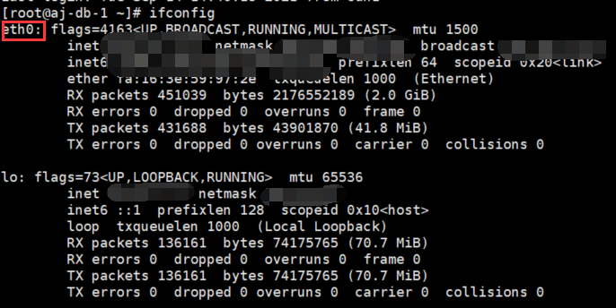
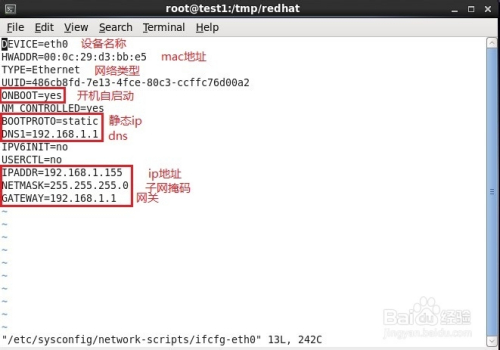

# 静态IP

1. 通过 `ifconfig` 命令查看当前ip地址和驱动名称
   
2. 配置静态 IP（如上图的驱动是 eth0），则执行 `vi /etc/sysconfig/network-scripts/ifcfg-eth0`
3. 编辑，填写ip地址、子网掩码、网关、DNS等。（其中“红框内的信息”是必须得有的）
   
4. 重启网络服务：`service network restart`

## 修改 DNS

```
vi /etc/resolv.conf
```