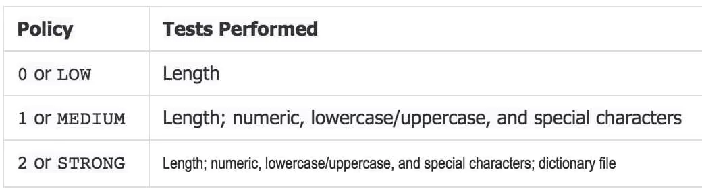

# MySQL 用户管理

MySQL 的用户表存储在 `mysql.user` 表中。

注：MySQL5.7 版本后，用户表中没有 password 字段，改成了 authentication_string。

## 新增用户

```sql
CREATE USER 'username'@'localhost' IDENTIFIED BY 'password';
-- username：你将要创建的用户名
-- localhost：要连接的主机，localhost表示只能在本地登陆，%表示任意主机都可以登录
-- password：要创建用户的登陆密码，密码可以为空（如果为空则该用户可以不需要密码登陆服务器）
```

## 查看用户

```sql
select `host`,`user` from mysql.user;
```

## 密码操作

> 注：MySQL5.7 版本以后，安全性得到了大幅度的上升，安装 MySQL5.7 成功以后会为 root 用户随机生成一个密码，打印在 `error_log` 配置项的文件夹中。
> 
> 可通过命令 `grep 'temporary password' /var/log/mysqld.log` 来查看密码。

### 查看密码策略

```sql
show VARIABLES like '%password%'
--'validate_password_policy'：密码策略
```

官方文档策略说明如下：



### 设置密码策略

```sql
mysql> set global validate_password_special_char_count=0; 参数是密码中非英文数字等特殊字符的个数，当密码策略是MEDIUM或以上时生效。
mysql> set global validate_password_length=6 参数是密码的长度
mysql> set global validate_password_mixed_case_count=0; 参数是密码中英文字符大小写的个数，当密码策略是MEDIUM或以上时生效。
mysql> set global validate_password_number_count=0;  参数是密码中至少含有的数字个数，当密码策略是MEDIUM或以上时生效。
mysql> set global validate_password_policy=0; 这个参数可以设为0、1、2，分别代表从低到高的密码强度，此参数的默认值为1，如果想将密码强度改弱，则更改此参数为0。
```

### 修改密码

```sql
方式1: ALTER USER 'root'@'localhost' IDENTIFIED WITH mysql_native_password BY '123456';
方式2: SET PASSWORD FOR 'root'@'localhost' = PASSWORD('123456');
方式3: mysql> use mysql; 
　　   mysql> UPDATE user SET Password = PASSWORD('123456') WHERE user = 'root'; 
　　   mysql> FLUSH PRIVILEGES;
```

## 权限操作

### 新增权限

**8.0版本以下的授权语句**

```sql
GRANT  privileges ON databasename.tablename TO 'username'@'localhost'
-- privileges：用户的操作权限，如：SELECT、INSERT、UPDATE、 等，如果要授予所有的权限则使用 [ALL PRIVILEGES]
-- databasename：数据库名
-- tablename ：表名

-- 示例：给用户username授予所有数据库所有表可查可增可更新的权限
GRANT ALL PRIVILEGES ON *.* TO 'username'@'%' IDENTIFIED BY 'password';
```

注意：权限操作完成后，要进行一步刷新权限表 `flush privileges;`。

**8.0版本的授权语句**

```sql
use mysql;
ALTER USER 'root'@'%' IDENTIFIED WITH mysql_native_password BY '123456';
GRANT ALL PRIVILEGES ON *.* TO 'root'@'%';
FLUSH PRIVILEGES;
```

### 查看权限

```sql
SHOW GRANTS FOR 'username'@'localhost'
```
