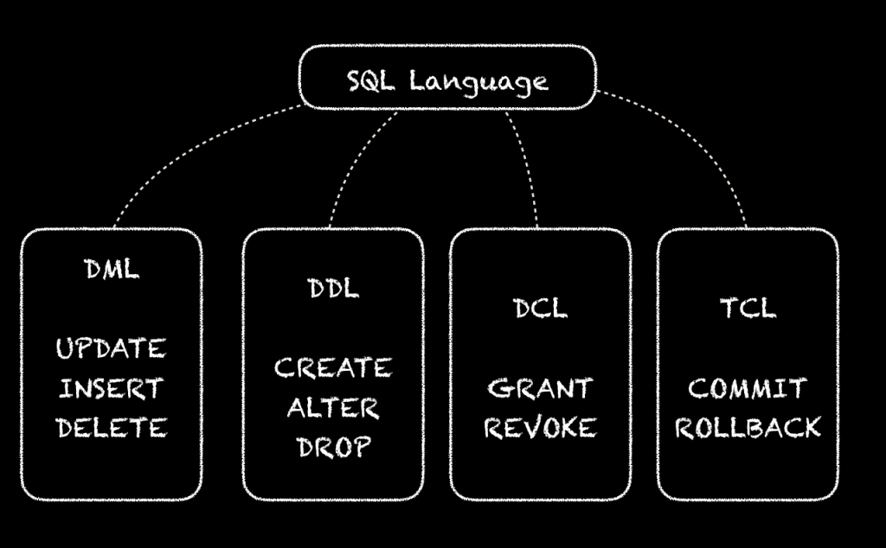

<!--
 * @Github       : https://github.com/superzhc/BigData-A-Question
 * @Author       : SUPERZHC
 * @CreateDate   : 2020-05-08 10:12:30
 * @LastEditTime : 2020-12-16 09:52:58
 * @Copyright 2020 SUPERZHC
-->
# 数据库

## 数据库和实例的定义

- **数据库**：物理操作系统文件或其他形式文件类型的集合。在 MySQL 数据库中，数据库文件可以是 frm、MYD、MYI、ibd 结尾的文件。
- **实例**：MySQL 数据库由后台线程以及一个共享内存区组成。共享内存可以被运行的后台线程所共享。需要牢记的是，**数据库实例才是真正用于操作数据库文件的**。

换一种更直白的理解：

- **数据库**：数据库是文件的集合，是依照某种数据模型组织起来并存放于二级存储器中的数据集合
- **实例**：数据库实例是程序，是位于用户与操作系统之间的一层数据管理软件，用户对数据库数据的任何操作，包括数据库定义、数据查询、数据维护、数据库运行控制等都是在数据库实例下进行的，应用程序只有通过数据库实例才能和数据库打交道

## 数据库基础

**数据库（database）**

> 保存有组织的数据的容器（通常是一个文件或一组文件）

**表（table）**

> 某种特定类型数据的结构化清单

**列（column）**

> 表中的一个字段。所有表都是由一个或多个列组成的

**数据类型**

> 所允许的数据的类型。每个表列都有相应的数据类型，它限制（或允许）该列中存储的数据

**行（row）**

> 表中的一个记录

**主键（primary key）**

> 一列（或一组列），其值能够唯一标识表中每一行

表中的任何列都可以作为主键，只要它满足以下条件：

- 任意两行都不具有相同的主键值
- 每一行都必须具有一个主键值（主键列不允许 NULL 值）
- 主键列中的值不允许修改或更新
- 主键值不能重用（如果某行从表中删除，它的主键不能赋给以后的新行）

**外键**

> 外键是表中的一列，其值必须列在另一表的主键中

外键是保证引用完整性的极其重要的部分

## SQL 四种语言：DDL,DML,DCL,TCL

### DDL - Data Definition Language

数据库定义语言：定义数据库的结构

其主要命令有 CREATE，ALTER，DROP 等，该语言不需要commit，因此慎重。

### DML - Data Manipulation Language

数据库操作语言：SQL 中处理数据库中的数据。

其主要命令有 INSERT,UPDATE,DELETE 等。

### DCL - Data Control Language

数据库控制语言：授权，角色控制等

GRANT – 为用户赋予访问权限

REVOKE – 撤回授权权限

### TCL - Transaction Control Language

事务控制语言

- COMMIT – 保存已完成的工作
- SAVEPOINT – 在事务中设置保存点，可以回滚到此处
- ROLLBACK – 回滚
- SET TRANSACTION – 改变事务选项

> SELECT 属于 DQL，数据查询语言：简称 `DQL`(Data Query Language)，用来查询数据库中表的记录，关键字：select from where 等

