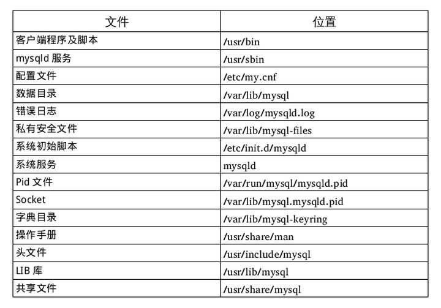

# MySQL5.7 在 CentOS7 上离线部署

> CentOS7 版本将 MySQL 数据库软件从默认的程序列表中移除，用 MariaDB 代替了，而安装 MySQL 的话会和 MariaDB 的文件冲突，所以需要先卸载掉 MariaDB。
> 
> ```bash
> yum list installed | grep mariadb    #检查mariadb是否安装
> 卸载命令一： yum -y remove mariadb*
> 卸载命令二： rpm -qa |grep mariadb |xargs yum remove -y
> ```

## 1. 下载 MySQL 

官方下载地址：<https://dev.mysql.com/downloads/mysql/>

```
Select Version: 5.7.32
Select Operating System: Red Hat Enterprise Linux / Oracle Linux
Select OS Version: All
```

选择 `Red Hat Enterprise Linux 7 / Oracle Linux 7 (x86, 64-bit), RPM Bundle (mysql-5.7.32-1.el7.x86_64.rpm-bundle.tar` 文件进行下载。

## 2. 上传安装文件并解压

**解压**

```bash
tar xf mysql-5.7.32-1.el7.x86_64.rpm-bundle.tar
```

解压后会获取到如下 rpm 包：

```
mysql-community-client（*客户端程序和工具）
mysql-community-server（*服务器程序和工具）
mysql-community-libs（*LIB库）
mysql-community-libs-compat（*LIB共享兼容库）
mysql-community-common（*公共文件）
mysql-community-devel（开发MySQL必备的头文件和库）
mysql-community-embedded（嵌入式库）
mysql-community-embedded-compat（嵌入式共享兼容库）
mysql-community-embedded-devel（嵌入式开发库）
mysql-community-test（测试套件）
```

## 3. 通过 rpm 方式安装

> 注：只安装必备包和部分包

```bash
rpm -ivh mysql-community-common-5.7.32-1.el7.x86_64.rpm
rpm -ivh mysql-community-libs-5.7.32-1.el7.x86_64.rpm
rpm -ivh mysql-community-libs-compat-5.7.32-1.el7.x86_64.rpm
~~rpm -ivh mysql-community-devel-5.7.32-1.el7.x86_64.rpm~~
rpm -ivh mysql-community-client-5.7.32-1.el7.x86_64.rpm
rpm -ivh mysql-community-server-5.7.32-1.el7.x86_64.rpm
~~rpm -ivh mysql-community-embedded-compat-5.7.32-1.el7.x86_64.rpm~~ #???，服务器有这个必要么
```

安装结束后会在 Linux 中生成如下相关文件目录：



## 4. 初始化数据库，并启动 MySQL

**初始化数据库**

```bash
mysqld --defaults-file=/etc/my.cnf --initialize-insecure --user=mysql
```

**给 mysql 用户分配文件夹权限**

```bash
# /data/mysql是配置项datadir的值，注意根据实际的值来进行设置
chown mysql:mysql /data/mysql -R
```

**启动 mysql**

```bash
systemctl start mysqld.service
```

**设置为自动启动**

```bash
systemctl enable mysqld
```