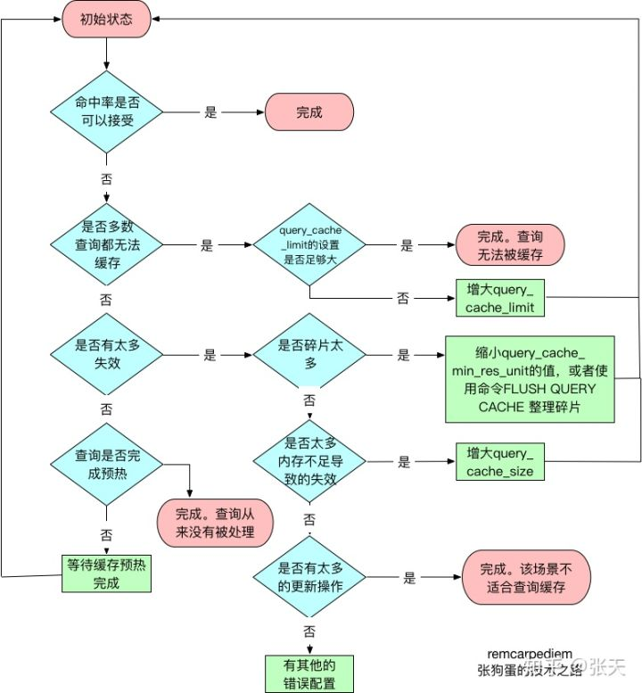
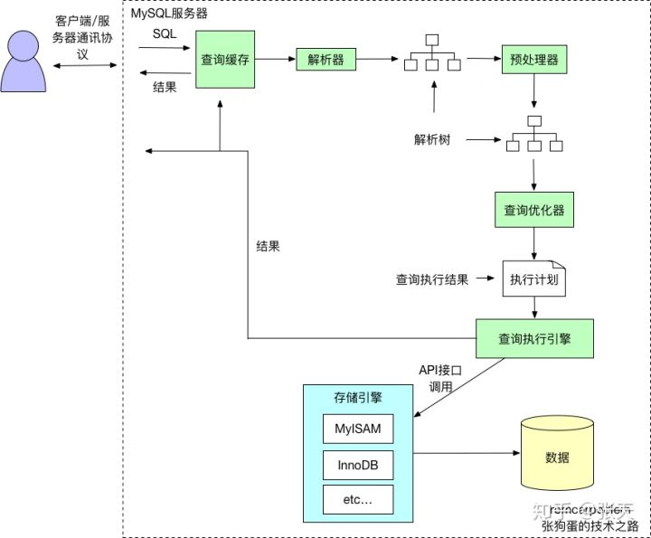

# 查询语句的执行过程

## 1 应用程序发送 SQL 到服务端

当执行SQL语句时，应用程序会连接到相应的数据库服务器，然后服务器对SQL进行处理。

## 2 查询缓存

接着数据库服务器会先去查询是否有该SQL语句的缓存，key是查询的语句，value是查询的结果。如果查询语句能够直接命中，就会直接从缓存中拿出value来返回客户端。

MySQL查询缓存保存查询返回的完整结构。当查询命中该缓存时，MySQL会立刻返回结果，跳过了解析、优化和执行阶段。 查询缓存系统会跟踪查询中涉及的每个表，如果这些表发生了变化，那么和这个表相关的所有缓存数据都将失效。 MySQL将缓存存放在一个引用表中，通过一个哈希值引用，这个哈希值包括了以下因素，即查询本身、当前要查询的数据库、客户端协议的版本等一些其他可能影响返回结果的信息。 当判断缓存是否命中时，MySQL不会进行解析查询语句，而是直接使用SQL语句和客户端发送过来的其他原始信息。所以，任何字符上的不同，例如空格、注解等都会导致缓存的不命中。 当查询语句中有一些不确定的数据时，则不会被缓存。例如包含函数`NOW()`或者`CURRENT_DATE()`的查询不会缓存。包含任何用户自定义函数，存储函数，用户变量，临时表，mysql数据库中的系统表或者包含任何列级别权限的表，都不会被缓存。 有一点需要注意，MySQL并不是会因为查询中包含一个不确定的函数而不检查查询缓存，因为检查查询缓存之前，MySQL不会解析查询语句，所以也无法知道语句中是否有不确定的函数。 事实则是，如果查询语句中包含任何的不确定的函数，那么其查询结果不会被缓存，因为查询缓存中也无法找到对应的缓存结果。 

有关查询缓存的配置如下所示：

- querycachetype:是否打开查询缓存。可以设置为OFF、ON和DEMAND。DEMAND表示只有在查询语句中明确写明SQL_CACHE的语句才会放入查询缓存。
- querycachesize:查询缓存使用的总内存空间。
- querycacheminresunit:在查询缓存中分配内存块时的最小单元。较小的该值可以减少碎片导致的内存空间浪费，但是会导致更频繁的内存块操作。
- querycachelimit:MySQL能够查询的最大查询结果。如果查询结果大于这个值，则不会被缓存。因为查询缓存在数据生成的时候就开始尝试缓存数据，所以当结果全部返回后，MySQL才知道查询结果是否超出限制。超出之后，才会将结果从查询缓存中删除。

对查询缓存的优化是数据库性能优化的重要一环。

判断流程大致如下图所示：

缓存命中率可以通过如下公式计算：Qcachehits/(Qcachehits + Com_select)来计算。

## 3 查询优化处理，生成执行计划

如果没有命中缓存，则开始第三步。

1. **解析SQL：**生成解析树，验证关键字（如select,where,left join 等）是否正确。 
2. **预处理：**进一步检查解析树是否合法，如检查数据表和列是否存在，验证用户权限等。 
3. **优化SQL：**决定使用哪个索引，或者在多个表相关联的时候决定表的连接顺序。紧接着，将SQL语句转成执行计划。

## 4 将查询结果返回客户端

最后，数据库服务器将查询结果返回给客户端。(如果查询可以缓存，MySQL也会将结果放到查询缓存中)

