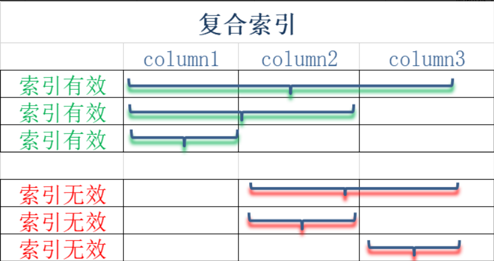
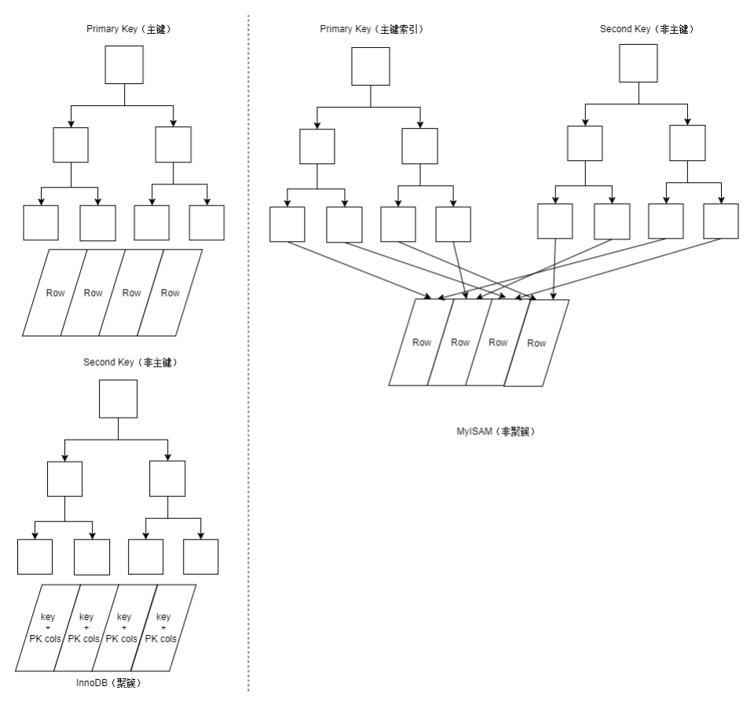

# 索引的使用原则

索引由于其提供的优越的查询性能，似乎不使用索引就是一个愚蠢的行为了。但是使用索引，是要付出时间和空间的代价的。因此，索引虽好不可贪多。

下面介绍几个索引的使用技巧和原则，在使用索引之前，应该对它们有充分的认识。

## 写操作比较频繁的列慎重加索引

索引在提高查询速度的同时，也由于需要更新索引而带来了降低插入、删除和更新带索引列的速度的问题。一张数据表的索引越多，在写操作的时候性能下降的越厉害。

## 索引越多占用磁盘空间越大

与没有加索引比较，加索引会更快地使磁盘接近使用空间极限。

## 不要为输出列加索引

为查询条件、分组、连接条件的列加索引，而不是为查询输出结果的列加索引。

例如下面的查询语句：

```mysql
select ip_address from t_user_action_log
    where name='LiSi'
    group by action
    order by create_time;
```

所以可以考虑增加在 `name` `action` `create_time` 列上，而不是 `ip_address`。

## 考虑维度优势

例如`action`列的值包含：1、2、3、4、5，那么该列的维度就是5。

维度越高（理论上维度的最大值就是数据行的总数），数据列包含的独一无二的值就越多，索引的使用效果越好。

对于维度很低的数据列，索引几乎不会起作用，因此没有必要加索引。

例如性别列的值只有男和女，每种查询结果占比大约50%。***一般当查询优化处理器发现查询结果超过全表的30%的时候，就会跳过索引，直接进行全表扫描***。

## 对短小的值加索引

对短小的值加索引，意味着索引所占的空间更小，可以减少I/O活动，同时比较索引的速度也更快。

尤其是主键，要尽可能短小。

另外，InnoDB 使用的是聚集索引（clustered index），也就是把主键和数据行保存在一起。主键之外的其他索引都是二级索引，这些二级索引也保留着一份主键，这样在查询到索引以后，就可以根据主键找到对应的数据行。如果主键太长的话，会造成二级索引占用的空间变大。

## 为字符串前缀加索引

前边已经讲过短小索引的种种好处了，有时候一个字符串的前几个字符就能唯一标识这条记录，这个时候设置索引的长度就是非常划算的做法。

## 复合索引的左侧索引

创建复合索引的语法如下：

```mysql
CREATE INDEX indexName ON tableName (column1 DESC, column2 DESC, column3 ASC);
```



可以看到，最左侧的column1索引总是有效的。

## 索引加锁

对于 InnoDB 来说，索引可以让查询锁住更少的行，从而可以在并发情况下拥有更佳表现。

## 覆盖索引

如果索引包含满足查询的所有数据，就被称为覆盖索引(Covering Indexes)，覆盖索引非常强大，可以大大提高查询性能。

覆盖索引高性能的原因是：

- 索引通常比记录要小，覆盖索引查询只需要读索引，而不需要读记录。
- 索引都按照值的大小进行顺序存储，相比与随机访问记录，需要更少的I/0。
- 大多数数据引擎能更好的缓存索引，例如MyISAM只缓存索引。

`ijiangtao_local_db_mysql`表的`action`列包含索引。使用`explain`分析下面的查询语句，对于索引覆盖查询(index-covered query)，分析结果`Extra`的值是`Using index`，表示使用了覆盖索引 :

```mysql
explain select `action` from ijiangtao_local_db_mysql.t_user_action_log;
```

| id   | select_type | table             | partitions | type  | possible_keys | key    | key_len | ref  | rows    | filtered | Extra       |
| ---- | ----------- | ----------------- | ---------- | ----- | ------------- | ------ | ------- | ---- | ------- | -------- | ----------- |
| 1    | SIMPLE      | t_user_action_log |            | index |               | action | 5       |      | 199,703 | 100.00   | Using index |

## 聚簇索引

聚簇索引(Clustered Indexes)保证关键字的值相近的元组存储的物理位置也相同，且一个表只能有一个聚簇索引。

字符串类型不建议使用聚簇索引，特别是随机字符串，因为它们会使系统进行大量的移动操作。

并不是所有的存储引擎都支持聚簇索引，目前 InnoDB 支持。

如果使用聚簇索引，最好使用 `AUTO_INCREMENT` 列作为主键，应该尽量避免使用随机的聚簇主键。

从物理位置上看，聚簇索引表比非聚簇的索引表，有更好的访问性能。



## 选择合适的索引类型

从数据结构角度来看，MySQL支持的索引类型有B树索引、Hash索引等。

- B树索引

B树索引对于<、<=、 =、 >=、 >、 <>、!=、 between查询，进行精确比较操作和范围比较操作都有比较高的效率。

B树索引也是InnoDB存储引擎默认的索引结构。

- Hash索引

Hash索引仅能满足=、<=>、in查询。

Hash索引检索效率非常高，索引的检索可以一次定位，不像B树索引需要从根节点到枝节点，最后才能访问到页节点这样多次的I/O访问，所以Hash索引的查询效率要远高于B树索引。但Hash索引不能使用范围查询。