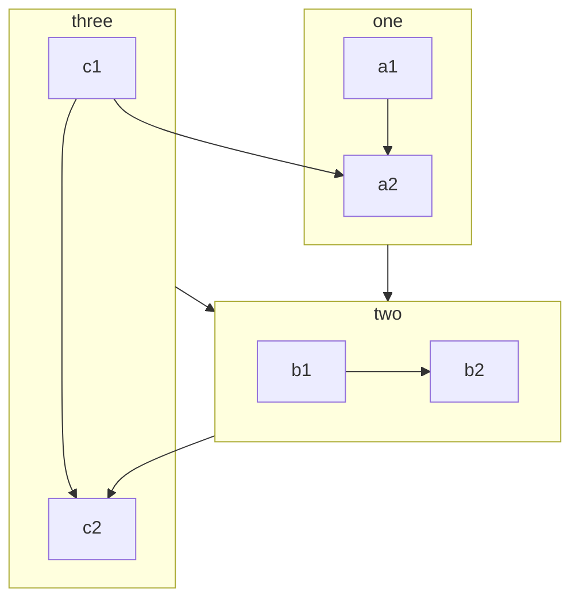
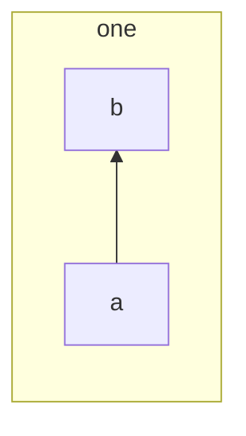

# Mermaid

## 流程图

**声明流程图方向**

- `graph` 或 `graph TB` 或 `graph TD`：从上往下
- `graph BT`：从下往上
- `graph LR`：从左往右
- `graph RL`：从右往左

**节点**

- 无名字的结点：直接写内容，此时结点边框为方形；节点内容不支持空格
- 有名字的结点：节点名后书写内容，内容左右有特定符号，结点边框由符号决定；节点内容可以有空格

**节点形状**

> 默认是方形

- 方形：`[]`
- 圆角矩形：`()`
- 半圆矩形：`([])`
- 双边矩形：`[[]]`
- 圆柱形：`[()]`
- 圆形：`(())`
- 菱形：`{}`
- 六边形：`{{}}`
- 平行四边形：`[//]`
- 反向平行四边形：`[\\]`
- 梯形：`[/\]`
- 反向梯形：`[\/]`

*示例*


**连线**

- 实线箭头
  - 无文本：`A-->B`
  - 有文本
    - `A--文本-->B`
    - `A-->|文本|B`
- 粗实线箭头
  - 无文本：`A==>B`
  - 有文本：`A==文本==>B`
- 虚线箭头
  - 无文本：`A-.->B`
  - 有文本：`A-.文本.->B`
- 无箭头
  - 无文本：
    - `A---B`
    - `A===B`
    - `A-.-B`
  - 有文本：
    - `A--文本---B`
    - `A==文本===B`
    - `A-.文本.-B`

**多重连接**

> 使用 `&` 可设置多个节点

### **子图**

需要将 `graph` 改为 `flowchart`，定义子图使用 `subgraph` 关键字，结束时要以 `end` 结尾

*示例*



**设置子图的方向**

> 在子图 subgraph 中使用 direction 来设置方向，<!--注意 flowchart 不要设置方向-->



## **注释**

> 在行首加入 `%%` 即可

## **内容转义**

> 特殊字符比如 `,` `()` `[]` `*` 等等无法被渲染，可以将文本放在英文双引号 `""` 内。

## 类图

**示例**

```Mermaid
classDiagram
Animal <|-- Duck
Animal <|-- Fish
Animal <|-- Zebra
Animal: +int Age
Animal: +String Gender
Animal: +IsMammal()
Animal: +Mate()
class Duck {
    +String BeakColor
    +Swim()
    +Quack()
}
class Fish {
    -int SizeInFeet
    -CanEat() boolean
}
class Zebra {
    +bool IsWild
    +Run()
}
```

### 定义类

使用关键字 `class` 来定义类，如 `class Animal`

**类类型定义**

可以用特定的标记注释类，该标记就像类的元数据一样，明确说明其性质。

| 类型              | 描述   |
| ----------------- | ------ |
| `<<Interface>>`   | 接口类 |
| `<<Abstract>>`    | 抽象类 |
| `<<Service>>`     | 服务类 |
| `<<Enumeration>>` | 列举类 |

类注释在 `<<` 与 `>>` 之间定义，有两种方法可以向类添加注释：

- 在定义类之后单独的行中
- 在嵌套结构中定义

### 定义类成员

UML 提供代表类成员的机制，例如属性和方法，以及有关它们的其他信息。

Mermaid 根据是否存在括号来区分属性和操作。具有的括号的被视为操作，而其他则被视为属性。

定义类成员有两种方法，无论使用哪个语法来定义成员，显示都相同。两种不同的方式是：

- 将成员和类名用冒号连接起来，每次可以定义一个成员
- 将成员使用大括号包裹起来，其中的成员都属于一个类，适合定义多个成员

**修饰符**

| 类型  | 描述                            |
| :---: | ------------------------------- |
|  `+`  | 公开（Public）                  |
|  `–`  | 私有（Private）                 |
|  `#`  | 保护（Protected）               |
|  `~`  | 限制（Package/Internal/Module） |
|  空   | 使用默认的类型                  |

**抽象、静态描述**

在成员定义之后设置如下符号，可定义成员为：

| 类型  | 描述             |
| :---: | ---------------- |
|  `*`  | 抽象（Abstract） |
|  `$`  | 静态（Static）   |

**方法返回值**

可以使用返回数据的类型结束操作的定义（注意：签名和返回值类型之间必须有一个空格）

**泛型类型**

使用 `~` 包裹类型来表示泛型

注意：目前 Mermaid 不支持嵌套模板类型

### 定义关系

关系是从类和对象上找到的特定逻辑连接

**语法**

```
[类A][箭头][类B]:标签
```

目前支持的不同类型之间的关系：

|  类型   | 描述                | 示例                  |
| :-----: | ------------------- | --------------------- |
| `<\|--` | 继承（Inheritance） | `classA <\|-- classB` |
|  `*--`  | 组合（Composition） | `classC *-- classD`   |
|  `o--`  | 聚合（Aggregation） | `classE o-- classF`   |
|  `<--`  | 关联（Association） | `classG <-- classH`   |
|  `--`   | 关联（Solid Link）  | `classI -- classJ`    |
|  `<..`  | 依赖（Dependency）  | `classK <.. classL`   |
| `<\|..` | 实现（Realization） | `classM <\|.. classN` |
|  `..`   | 关联（Dashed Link） | `classO .. classP`    |

可以使用标签来描述两个类之间关系的性质。此外，箭头也可以在相反的方向使用。

### **关系的基数**

类图中的基数表示与另一类实例关联的实例数。

不同的基数选项是：

| 类型   | 描述                 |
| ------ | -------------------- |
| `1`    | 有且仅有1个          |
| `0..1` | 最多1个              |
| `1..*` | 1个或多个            |
| `*`    | 多个                 |
| `n`    | N个（其中N大于1）    |
| `0..n` | 0至N个（其中N大于1） |
| `1..n` | 1至N个（其中N大于1） |

**语法**

```
[类A] "基数1" [箭头] "基数2" [类B]:标签
```

**示例**

```
Customer "1" --> "*" Ticket
Student "1" --> "1..*" Course
Galaxy --> "many" Star : Contains
```