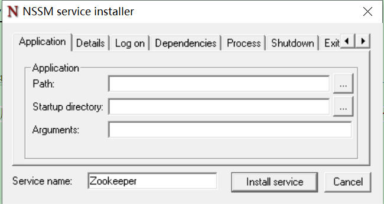

# NSSM-服务管理工具

NSSM 是一个服务封装程序，它可以将普通 exe 程序封装成服务，使之像 windows 服务一样运行。同类型的工具还有微软自己的srvany，不过 nssm 更加简单易用，并且功能强大。它的特点如下：

- 支持普通 exe 程序（控制台程序或者带界面的Windows程序都可以）
- 安装简单，修改方便
- 可以重定向输出（并且支持Rotation）
- 可以自动守护封装了的服务，程序挂掉了后可以自动重启
- 可以自定义环境变量

**下载地址**

> <https://nssm.cc/download>

**常用命令**

```
安装服务：nssm install 服务名
删除服务：nssm remove 服务名
删除服务确定：nssm remove 服务名 confirm
修改服务（显示界面修改）：nssm edit 服务名
启动服务：nssm start 服务名
停止服务：nssm stop 服务名
重启服务：nssm restart 服务名
```

## 使用

**注册服务**

需要使用管理员权限的命令行环境（或PowerShell）输入 `nssm install` 会弹出配置界面



配置项详解：

- Path：应用程序/执行脚本的地址，如 `D:\soft\bigdata\apache-zookeeper-3.7.0-bin\bin\zkServer.cmd`
- Startup directory：选择 Path 后，Startup directory 选择会自动填充
- Argument：为启动服务的参数

