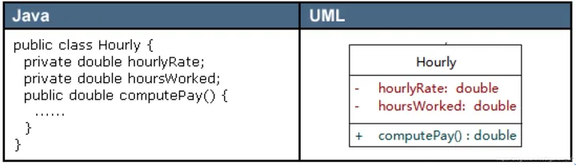
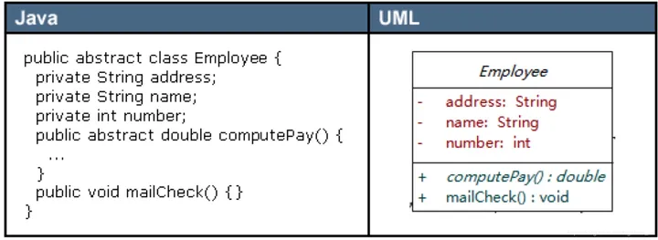
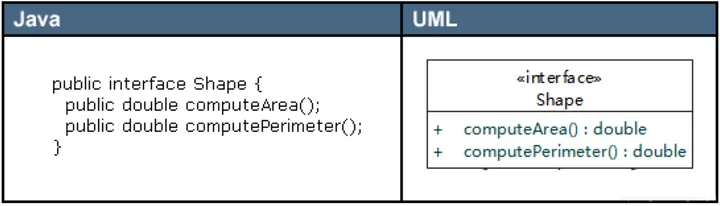
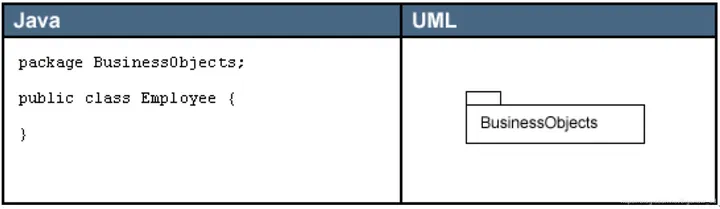
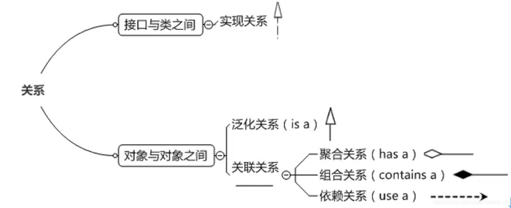
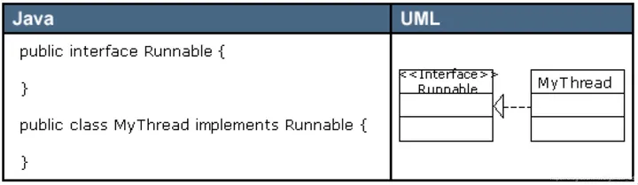
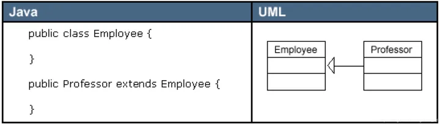
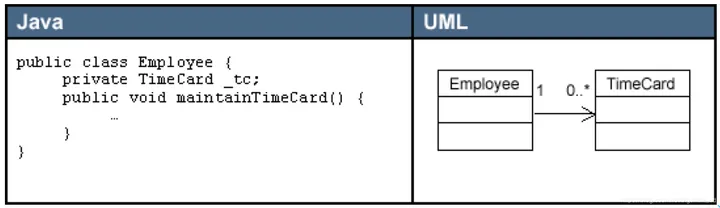
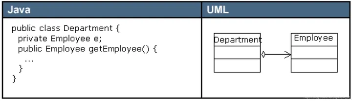
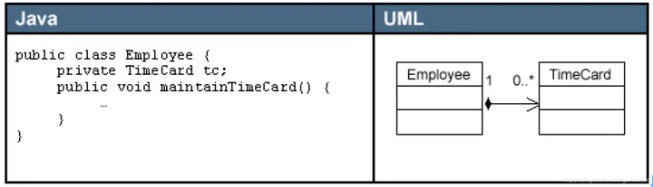

# UML：类图

## 类的表示形式

### 具体类

> 具体类在类图中用矩形框表示，矩形框分为三层：第一层是类名字。第二层是类的成员变量；第三层是类的方法。

### 抽象类

> 抽象类在UML类图中同样用矩形框表示，但是抽象类的类名以及抽象方法的名字都用斜体字表示

### 接口

> 接口在类图中也是用矩形框表示，但是与类的表示法不同的是，接口在类图中的第一层顶端用构造型 `<<interface>>` 表示，下面是接口的名字，第二层是方法

### 包

> 类和接口一般都出现在包中，UML 类图中包的表示形式如下图所示

## 类之间的关系形式

> 类和类、类和接口、接口和接口之间存在一定关系，UML 类图中一般会有连线指明它们之间的关系。关系共有六种类型，分别是 **实现关系**、**泛化关系**、**关联关系**、**依赖关系**、**聚合关系**、**组合关系**

### 实现关系

> 实现关系是指接口及其实现类之间的关系。在UML类图中，实现关系用空心三角和虚线组成的箭头来表示，从实现类指向接口

### 泛化关系

> 泛化关系（Generalization）是指对象与对象之间的继承关系。如果对象A和对象B之间的 `is a` 关系成立，那么二者之间就存在继承关系，对象 B 是父对象，对象 A 是子对象。
>
> 在UML类图中，泛化关系用空心三角和实线组成的箭头表示，从子类指向父类

### 关联关系

> 关联关系（Association）是指对象和对象之间的连接，它使一个对象知道另一个对象的属性和方法。
>
> 关联关系有单向关联和双向关联。如果两个对象都知道（即可以调用）对方的公共属性和操作，那么二者就是双向关联。如果只有一个对象知道（即可以调用）另一个对象的公共属性和操作，那么就是单向关联。
>
> 在UML图中，双向关联关系用带双箭头的实线或者无箭头的实线双线表示。单向关联用一个带箭头的实线表示，箭头指向被关联的对象

一个对象可以持有其它对象的数组或者集合。在UML中，通过放置多重性（multipicity）表达式在关联线的末端来表示。多重性表达式可以是一个数字、一段范围或者是它们的组合。多重性允许的表达式示例如下：

- 数字：精确的数量
- `*` 或者 `0..*`：表示 0 到多个
- `0..1`：表示 0 或者 1 个
- `1..*`：表示 1 到多个

关联关系又分为依赖关联、聚合关联和组合关联三种类型。

### 依赖关系

> 依赖（Dependency）关系是一种弱关联关系。如果对象A用到对象B，但是和B的关系不是太明显的时候，就可以把这种关系看作是依赖关系。如果对象A依赖于对象B，则 A “use a” B。
>
> 在UML类图中，依赖关系用一个带虚线的箭头表示，由使用方指向被使用方，表示使用方对象持有被使用方对象的引用

### 聚合关系

> 聚合（Aggregation）是关联关系的一种特例，它体现的是整体与部分的拥有关系，即 “has a” 的关系。此时整体与部分之间是可分离的，它们可以具有各自的生命周期，部分可以属于多个整体对象，也可以为多个整体对象共享，所以聚合关系也常称为共享关系。
>
> 在UML图中，聚合关系用空心菱形加实线箭头表示，空心菱形在整体一方，箭头指向部分一方

### 组合关系

> 组合（Composition）也是关联关系的一种特例，它同样体现整体与部分间的包含关系，即 “contains a” 的关系。但此时整体与部分是不可分的，部分也不能给其它整体共享，作为整体的对象负责部分的对象的生命周期。这种关系比聚合更强，也称为强聚合。如果A组合B，则A需要知道B的生存周期，即可能A负责生成或者释放B，或者A通过某种途径知道B的生成和释放。
>
> 在UML图中，组合关系用实心菱形加实线箭头表示，实心菱形在整体一方，箭头指向部分一方

## 修饰符

- `+` : 公开（Public）
- `-` : 私有（Private）
- `#` : 保护（Protected）
- `~` : 限制（Package/Internal/Module）
- ` ` : 不带符号表示 default