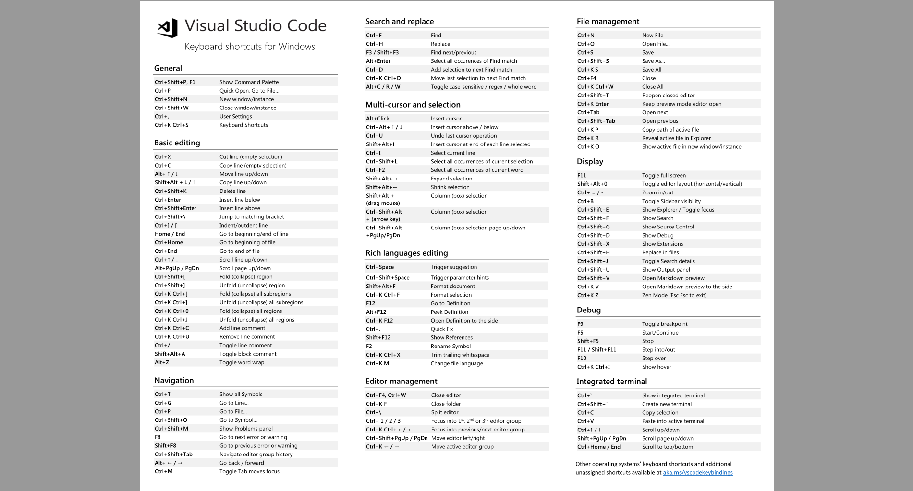

<!--
 * @Github       : https://github.com/superzhc/BigData-A-Question
 * @Author       : SUPERZHC
 * @CreateDate   : 2020-12-29 10:17:57
 * @LastEditTime : 2020-12-29 10:33:04
 * @Copyright 2020 SUPERZHC
-->
# VSCode

> 参考书籍：[Microsoft Visual Studio Code 中文手册](https://www.gitbook.com/book/jeasonstudio/vscode-cn-doc)

> Visual Studio Code 是微软推出的跨平台编辑器。它采用经典的VS的UI布局，功能强大，扩展性很强。

vs code 的宣传语：

> 一个运行于 Mac OS X、Windows和 Linux 之上的，针对于编写现代 Web 和云应用的跨平台源代码编辑器。

## 概述

> Visual Studio Code 是一个运行在桌面上，并且可用于Windows，Mac OS X和Linux平台的的轻量级且功能强大的源代码编辑器。它配备了内置的JavaScript的，TypeScript和Node.js的支持，并具有其他语言（C ++，C＃，Python和PHP）的扩展以及一个丰富的生态系统。

> [下载地址](https://code.visualstudio.com/download)

### 特性

- 智能代码提示和自动补全
- 简化调试过程
- 快速、强大的编辑功能（静态源代码检查、多光标编辑、参数提示，以及其他强大的编辑功能）
- 代码导航和重构
- 对于产品的Git支持
- 跨平台支持Linux、Mac OSX和Windows                         

## 编辑器

### 主命令面板

命令面板提供了许多的命令，可以使用同一交互窗口执行编辑器命令、打开文件、查询字符或者查看文件大纲

`F1`或`ctrl+shift+p`:打开命令面板。在打开的输入框内，可以输入任何命令，例如：
- 按一下`backspace`会进入`ctrl+p`模式，快速打开文件(workbench.action.quickOpen)：通过键入文件或符号来导航至相应的位置
- 在`ctrl+P`下输入 `>` 可以进入 `Ctrl+Shift+P` 模式,显示所有命令(workbench.action.showCommands) 直接跳转到编辑器命令面板
- 在 `Ctrl+P` 窗口下还可以:
    - 直接输入文件名，跳转到文件
    - `?`:列出当前可执行的动作
    - `!`:显示Errors或Warnings，也可以`ctrl+shift+M`
    - `:`:跳转到行数，也可以`ctrl+G`直接进入
    - `@`:跳转到symbol（搜索变量或者函数），可以根据分类跳转到symbol，查找属性或函数，也可通过`ctrl+shift+o`直接进入
    - `#`:根据名字查找symbol，也可以`ctrl+T`

### 常用快捷键

#### 编辑器与窗口管理

- 打开一个新窗口：`ctrl+shift+N`
- 关闭窗口：`ctrl+shift+W`
- 新建文件: `Ctrl+N`
- 文件之间切换:`Ctrl+Tab`
- 切出一个新的编辑器（最多 3 个）： `Ctrl+\`，也可以按住 Ctrl 鼠标点击 Explorer 里的文件名
- 左中右 3 个编辑器的快捷键： `Ctrl+1`、`Ctrl+2`、`Ctrl+3`
- 3 个编辑器之间循环切换： `Ctrl+`
- 编辑器换位置，`Ctrl+k`然后按 Left或 Right

#### 代码编辑

##### 格式调整

- 代码行缩进: `Ctrl+[`、`Ctrl+]`
- `Ctrl+C`、`Ctrl+V`:复制或剪切当前行/当前选中内容
- 代码格式化:`Shift+Alt+F`，或 `Ctrl+Shift+P`后输入`format code`
- 上下移动一行：`Alt+Up`或`Alt+Down`
- 向上向下复制一行：`Shift+Alt+Up`或`Shift+Alt+Down`
- 在当前行下边插入一行: `Ctrl+Enter`
- 在当前行上方插入一行:`Ctrl+Shift+Enter`

##### 光标相关

- 移动到行首： `Home`
- 移动到行尾： `End`
- 移动到文件结尾： `Ctrl+End`
- 移动到文件开头： `Ctrl+Home`
- 移动到定义处： `F12`
- 定义处缩略图：只看一眼而不跳转过去 `Alt+F12`
- 移动到后半个括号： `Ctrl+Shift+]`
- 选择从光标到行尾： `Shift+End`
- 选择从行首到光标处： `Shift+Home`
- 删除光标右侧的所有字： `Ctrl+Delete`
- 扩展/缩小选取范围： `Shift+Alt+Left` 和 `Shift+Alt+Right`
- 多行编辑(列编辑)：`Alt+Shift+鼠标左键`， `Ctrl+Alt+Down/Up`
- 同时选中所有匹配： `Ctrl+Shift+L`
- `Ctrl+D`:下一个匹配的也被选中 (在 sublime 中是删除当前行，后面自定义快键键中，设置与 Ctrl+Shift+K 互换了)
- 回退上一个光标操作： `Ctrl+U`
- 选中所有匹配词批量编辑：鼠标高亮选中需要查找的词，按下 `Ctrl + Shift + L`键，即可快速选中当前文件中所有匹配的词，并在每一个词后面有一个编辑光标，可批量同步编辑

##### 重构代码

- 找到所有的引用： `Shift+F12`
- 同时修改本文件中所有匹配的： `Ctrl+F12`
- 重命名：比如要修改一个方法名，可以选中后按 F2，输入新名字，回车，则所有该方法的引用也都同步更新了
- 跳转到下一个 Error 或 Warning：当有多个错误时可以按 F8 逐个跳转
- 查看 diff： 在 explorer 里选择文件右键 Set file tocompare，然后需要对比的文件上右键选择 Compare with file_name_you_chose- 

##### 查找替换

- 查找:`Ctrl+F`
- 查找替换:`Ctrl+H`
- 整个文件夹中查找:`Ctrl+Shift+F`

##### 显示相关

- 全屏:`F11`
- zoomIn/zoomOut：`Ctrl +/-`
- 侧边栏显/隐:`Ctrl+B`
- 显示资源管理器:`Ctrl+Shift+E`
- 显示搜索:`Ctrl+Shift+F`
- 显示 Git:`Ctrl+Shift+G`
- 显示 Debug:`Ctrl+Shift+D`
- 显示 Output:`Ctrl+Shift+U`

### 运行环境配置

#### Markdown 配置

##### 实时预览

新版的 VScode 已经支持 Markdown 实时预览了，支持解析的标记应该是 GitHub 支持的标准。

##### Markdown 转 HTML

- 通过构建转换环境
- vscode中通过插件来进行转换

- `Copy Markdown as HTML`:它用起来不是很方便。你需要创建一个空的 HTML 文件，然后到 markdown 文件里按 Ctrl+Shift+P 呼出命令栏，然后选择Markdown: Copy as HTML命令得到 HTML 文件（这会儿 HTML 在剪切板里），然后再回到先前的 HTML 文件中粘贴并保存，这样才能最终转换成 HTML 文件，而且解析样式不能通过设置来自定义，要修改样式，要自己写 CSS 样式。不管如何到底也是成功装换了。

##### Markdown 转 PDF

- `Markdown PDF`:这个插件可以把你在编辑区打开的 Markdown 文件转换成 PDF 文件，而且命令就在鼠标右键菜单里：Convert Markdown to PDF使用起来非常方便，它会直接生成到 Markdown 所在的目录里（可通过设置指定生成目录（路径））。它还支持通过设置控制样式或者其他的显示（隐藏）内容。 设置：文件》首选项》设置》Markdown-pdf configuration里面有各项参数，你可以按照自己的需求进行自定义设置。其中："markdown-pdf.outputDirectory"项就可以设置 PDF 生成保存的路径，默认是保存到当前路径 (markdown 文件所在路径)。它算是比较人性化的插件了吧。
- md2pdf

##### Markdown 转 Word 及其他格式

- `vscode-pandoc`:算是专门转换 Markdown 的插件吧，支持把 Markdown 转成 HTML、PDF、Word
- `md2reader`:把 Markdown 转换成EPUD/MOBI格式

## 插件

VS Code所有的插件都可以在[VS Code Downloads](https://marketplace.visualstudio.com/vscode)插件库中找到

|                          插件名                           | 作用                                                             |
| :-------------------------------------------------------: | ---------------------------------------------------------------- |
| Chinese (Simplified) Language Pack for Visual Studio Code | 适用于 VS Code 的中文（简体）语言包。                            |
|              [vscode-pandoc](#vscode-pandoc)              | Markdown 转 Word 及其他格式插件                                  |
|                        Code Runner                        | 代码编译运行看结果，支持众多语言                                 |
|                        Git History                        | 查看git分支提交日志的插件                                        |
|                       vscode-icons                        | vscode 图标                                                      |
|                         filesize                          | 在底部状态栏显示当前文件大小，点击后还可以看到详细创建、修改时间 |
|                    Markdown All in One                    |

### vscode-pandoc

> Markdown 转 Word 及其他格式插件