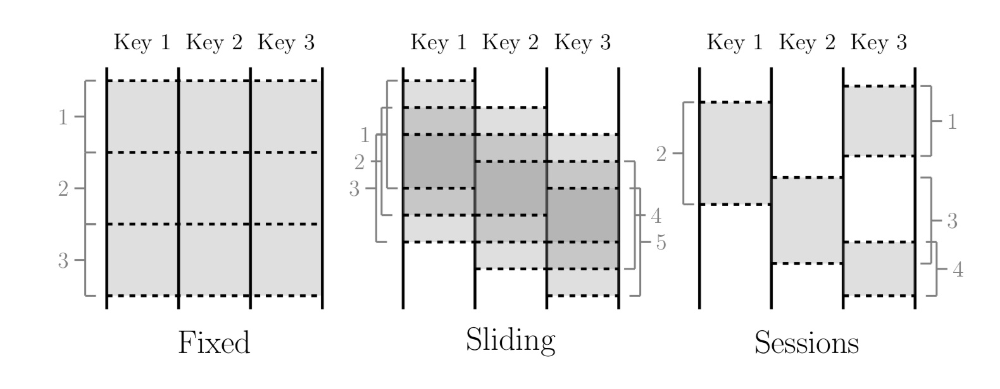
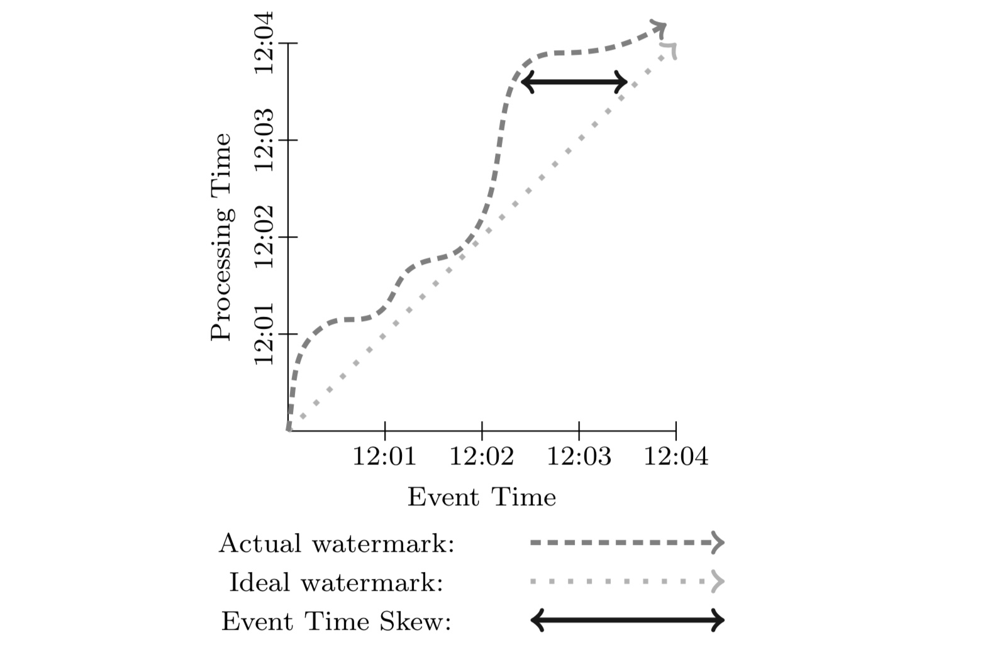
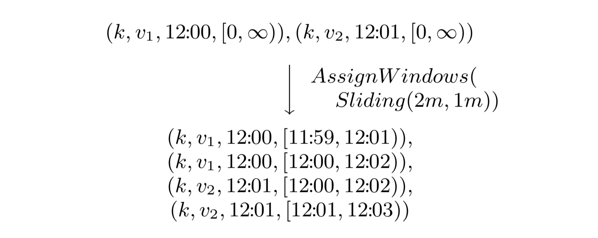
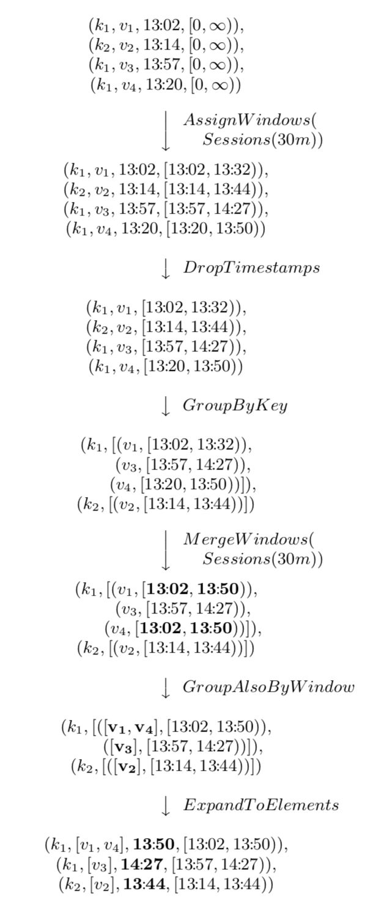

# 现代流式计算的基石：Google DataFlow

## 0. 引言

今天这篇继续讲流式计算。继上周阿里巴巴收购 Apache Flink 之后，Flink 的热度再度上升。毫无疑问，Apache Flink 和 Apache Spark （Structured Streaming）现在是实时流计算领域的两个最火热的话题了。那么为什么要介绍 Google Dataflow 呢？***Streaming Systems*** 这本书在分析 Flink 的火热原因的时候总结了下面两点：

> "There were two main reasons for Flink’s rise to prominence:
>
> - Its rapid adoption of the Dataflow/Beam programming model, which put it in the position of being the most semantically capable fully open source streaming system on the planet at the time.
> - Followed shortly thereafter by its highly efficient snapshotting implementation (derived from research in Chandy and Lamport’s original paper "Distributed Snapshots: Determining Global States of Distributed Systems” [Figure 10-29]), which gave it the strong consistency guarantees needed for correctness. "
>
> 摘录来自: Tyler Akidau, Slava Chernyak, Reuven Lax. “Streaming Systems。”

简单来说一是实现了 Google Dataflow/Bean 的编程模型，二是使用分布式异步快照算法 Chandy-Lamport 的变体。 Chandy-Lamport 算法在本专栏的上一篇文章已经说过了。

Apache Spark 的 2018 年的论文中也有提到

> Structured Streaming combines elements of Google Dataflow [2], incremental queries [11, 29, 38] and Spark Streaming [37] to enable stream processing beneath the Spark SQL API.

所以说，称 Google Dataflow 为现代流式计算的基石，一点也不为过。我们这篇文章就来看一下 Google Dataflow 的具体内容，主要参考于 2015 年发表与 VLDB 的 Dataflow 论文：***The dataflow model: a practical approach to balancing correctness, latency, and cost in massive-scale, unbounded, out-of-order data processing***。

## 1. Overview

Google Dataflow 模型旨在提供一种统一批处理和流处理的系统，现在已经在 Google Could 使用。其内部使用 Flume 和 MillWheel 来作为底层实现，这里的 Flume 不是 Apache Flume，而是 MapReduce 的编排工具，也有人称之为 FlumeJava；MillWheel 是 Google 内部的流式系统，可以提供强大的无序数据计算能力。关于 Google Cloud 上面的 Dataflow 系统感兴趣的可以参考官网链接 [CLOUD DATAFLOW](https://cloud.google.com/dataflow/?hl=zh-cn)。我们这里重点看一下 Dataflow 模型。

Dataflow 模型的核心点在于：

- 对于无序的流式数据提供基于 event-time 的顺序处理、基于数据本身的特征进行窗口聚合处理的能力，以及平衡正确性、延迟、成本之间的相互关系。
- 解构数据处理的四个维度，方便我们更好的分析问题：
  - **What** results are being computed.
  - **Where** in event time they are been computed.
  - **When** in processing time they are materialized.
  - **How** earlier results relate to later refinements.

对于这四个问题，我们看完了 Dataflow 模型的整体架构再来回答一下。

- 将数据处理中的逻辑概念和底层物理实现解耦

具体来说，主要包括以下几部分：

- **Windowing Model**，支持非对齐的 event time 的窗口聚合
- **Triggering Model**，提供强大和灵活的声明式 API 来描述 Trigger 语义，可以根据事件处理的运行时特征来决定输出次数。
- **Incremental Processing Model**，将数据的更新整合到上面的 **Window** 模型和 **Trigger** 模型中。
- **Scalable implementation**，基于 MillWheel 流式引擎和 Flume 批处理引擎实现的 Google Dataflow SDK，用户无需感知底层系统。
- **Core Principle**，模型设计的核心原则。
- 最后是案例分析。

## 2. 核心概念

### 2.1 Unbounded/Bounded vs Streaming/Batch

在 Dataflow 之前，对于有限/无限数据集合的描述，一般使用批/流 （Batch/Streaming），总有一种暗示底层两套引擎（批处理引擎和流处理引擎）。对于批处理和流处理，一般情况下是可以互相转化的，比如 Spark 用微批来模拟流。而 Dataflow 模型一般将有限/无限数据集合称为 Bounded/Unbounded Dataset，而 Streaming/Batch 用来特指执行引擎。

### 2.2 Window

Window，也就是窗口，将一部分数据集合组合起操作。在处理无限数据集的时候有限操作需要窗口，比如 **aggregation**，**outer join**，**time-bounded** 操作。窗口大部分都是基于时间来划分，但是也有基于其他存在逻辑上有序关系的数据来划分的。窗口模型主要由三种：**Fixed Window**，**Sliding Window**，**Session Window**。

#### 1 Fixed Window

Fixed Window ，有时候也叫 Tumbling Window。Tumble 的中文翻译有“翻筋斗”，我们可以将 Fixed Window 是特定的时间长度在无限数据集合上翻滚形成的，核心是每个 Window 没有重叠。比如小时窗口就是 12:00:00 ~ 13:00:00 一个窗口，13:00:00 ~ 14:00:00 一个窗口。从例子也可以看出来 Fixed Window 的另外一个特征：aligned，中文一般称为对齐。可能有些人还是不太明白。那么我举一个在编程语言中一个例子：address alignment，内存地址*a*被称为*n字节对齐*，当*a*是*n*的倍数（*n*应是2的幂）。但是有时候处于某些目的，窗口也可以是不对齐的。

#### 2 Sliding Window

Sliding Window，中文可以叫滑动窗口，由两个参数确定，窗口大小和滑动间隔。比如每分钟开始一个小时窗口对应的就是窗口大小为一小时，滑动间隔为一分钟。滑动间隔一般小于窗口大小，也就是说窗口之间会有重叠。滑动窗口在很多情况下都比较有用，比如检测机器的半小时负载，每分钟检测一次。Fixed Window 是 Sliding Window 的一种特例：窗口大小等于滑动间隔。

#### 3 Session Window

Session Window，中文可以叫会话窗口， 一般用来捕捉一段时间内的行为，比如 Web 中一段时间内的登录行为为一个 Session，当长时间没有登录，则 Session 失效，再次登录重启一个 Session。Session Window 也是用超时时间来衡量，只要在超时时间内发生的事件都认为是一个 Session Window。

### 2.3 Time Domain

在流式处理中关于时间有两个概念需要注意：

- **Event Time**，事件发生的时间。
- **Processing TIme**，事件在系统中的处理时间。

这两个概念非常简单。比如在 IoT 中，传感器采集事件时对应的系统时间就是 Event Time，然后事件发送到流式系统进行处理，处理的时候对应的系统时间就是 Processing Time。虽然是两个很简单概念，但是在 Dataflow 模型之前，很多系统并没有显示区分，比如 Spark Streaming。

在现实中，由于通信延迟、调度延迟等，往往导致 Event Time 和 Processing Time 之间存在差值（skew），且动态变化。skew 一般使用 watermark 来进行可视化，如下图。

## 3. Dataflow Model

这一节来讨论一下 Dataflow 模型的形式化定义，并解释为什么足够 general，可以同时支持批和流等系统。

### 3.1 Core Primitives

Dataflow 针对 (key, value) 数据对提供了两种基本的操作原语：**ParDo** 和 **GroupByKey**。

- **ParDo**，(key, value) 上的 transformation 操作，类似 Spark RDD 中的 map （一个 kv 产生一个 kv）和 flatMap 算子（一个 kv 产生不定个数的 kv）。形式化定义如下

- **GroupByKey** 类似 Spark 中的聚合算子，形式化定义如下。与 **ParDo** 不同（**ParDo** 可以天然的应用到无限数据流）， **GroupByKey** 这种聚合操作需要结合窗口一起使用。

### 3.2 Window

支持 **GroupByKey** 聚合的系统一般是在底层将其实现为 **GroupByKeyAndWindow**。Dataflow 在这上面的改进主要在于支持非对齐的窗口，底层的支持主要通过下面两步来做：一是将所有的窗口当成非对齐窗口来处理；二是所有的窗口操作可以分解成下面两步：分配和合并。

- Set AssignWindows(T datum) 将数据分配到 0 个或多个窗口中。
- Set MergeWindows(Set windows) 窗口合并操作，这个是流数据处理中非常有用。

需要注意的是，为了支持基于 event time 的窗口聚合操作，数据的表示不再使用 (***key***, ***value***) 数据对，而是用 (***key***, ***value***, ***event_time***, ***window***) 四元组来表示。在数据进入系统中的时候，系统会默认给数据分配一个全局的 window。

#### 3.2.1 Window Assignment

从模型的角度来看，窗口分配是将数据拷贝到对应的窗口。下图是一个窗口大小为 2 分钟，滑动间隔为 1 分钟的滑动窗口示例。

#### 3.2.2 Window Merge

窗口合并用在 **GroupByKeyAndWindow** 操作中，下面用一个超时时间为 30 分钟的会话窗口的例子来说明，如下图。

我们从图中可以看到所有数据的窗口都被初始化为 0 到无穷大。然后所有数据都被分配到一个由自己的时间戳 timestamp 和 timestamp + 30min 的窗口中。再之后执行 GroupByKeyAndWindow 操作，实际上是由下面 5 个部分组成，大家结合上面的图例应该可以很清楚明白其表达的含义。

- DropTimestamps
- GroupByKey
- MergeWindows
- GroupAlsoByWindow
- ExpandToElements

### 3.3 Triggers & Incremental Processing

构建基于 event time 的非对齐窗口无疑是一种进步，但是现在还有两个问题需要解决一下。

- 为了和其他流式系统的语义保持兼容，需要提供基于 processing time 和基于 tuple 的窗口。
- 我们需要知道何时发送窗口的结果数据。由于 event time 是无序，数据可能晚到，比如对于窗口 [12:00:00 ~ 13:00:00]，现在就算过了 13:00:00，event time 处于这个区间的数据还是有可能被发送过来，那么我们要等待多久呢？

第一个问题，我理解还算好解决，将 processing time 当成 event time 处理就行了。我们来讨论第二个问题，用更专业的话来说，就是如何保证窗口数据的完整性。针对这个问题一种最直接的想法是使用一种全局的 event time 进度指标，比如 watermark 来处理。watermark 语义上就是一个时间戳，可以理解为一个阈值。但是如何设置 watermark 是个很难的问题，因为由于多种原因，数据到达可快可慢。

在以前数据处理模式中，这种准确性问题一般使用 Lambda 架构来解决。这里的 Lambda 架构不是 AWS 的 Serverless，而是先用流式系统保证时效性和近似的准确性，然后再使用批处理系统异步执行来保证数据的完整性。这种架构也是非常的低效。

Dataflow 对于这个问题的处理使用一种叫做 "Trigger" 的机制，也就是说我们通过 Trigger 控制窗口数据输出结构，而对于尚未到达的事件可以使用不同的处理策略。这里我理解，也是一种类似 Lambda 架构的迂回模式，如果我的理解有误，欢迎指教。这里提到的 Trigger 之后的数据处理策略主要有三种：

- **Discarding**，窗口数据 Trigger 之后直接丢弃。
- **Accumulating**，这种方式类似 Lambda 架构，也就是 Trigger 之后，窗口的结果数据被保存下来以支持后面的数据进行更新。
- **Accumulating & Retracting**，在第二种的基础上提供了回退操作，也就是在之后再 Trigger 的时候，先触发一次撤回操作，再下发新的结果。这种方式在某些场景下还是很有用的。

## 4. 总结

我们前面提到数据处理解构出来的四个维度，我们现在来看一下如何解决。

- **What** results are being computed. => Transformation
- **Where** in event time they are been computed. => Window
- **When** in processing time they are materialized. => Watermark and Trigger
- **How** earlier results relate to later refinements. => Discarding, Accumulating, Accumulating & Retracting.

现在回头来看 Dataflow 模型，很多地方看上去都是自然而然的结果，但是不得不说确实为数据处理提供了一套可以参考的方法论或者标准，目前来看 Apache Spark 和 Apache Flink 也都是朝着这个方向发展的。

## Reference

1. Akidau T, Bradshaw R, Chambers C, et al. The dataflow model: a practical approach to balancing correctness, latency, and cost in massive-scale, unbounded, out-of-order data processing[J]. Proceedings of the VLDB Endowment, 2015, 8(12): 1792-1803.