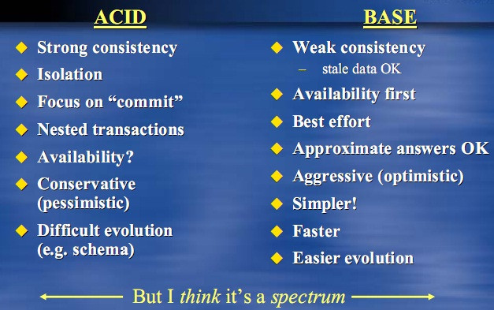

# 数据库理论之ACID和BASE的比较

> 来源：<http://www.sigma.me/2011/06/17/database-ACID-and-BASE.html>

传统关系型数据库系统的事务都有ACID的属性，即原子性（Atomicity）、一致性（Consistency）、隔离性（Isolation，又称独立性）、持久性（Durability）。英文为：

- **A**tomic: Everything in a transaction succeeds or the entire transaction is rolled back.
- **C**onsistent: A transaction cannot leave the database in an inconsistent state.
- **I**solated: Transactions cannot interfere with each other.
- **D**urable: Completed transactions persist, even when servers restart etc.
- 中译为：

- **原子性**: 整个事务中的所有操作，要么全部完成，要么全部不完成，不可能停滞在中间某个环节。事务在执行过程中发生错误，会被回滚（Rollback）到事务开始前的状态，就像这个事务从来没有执行过一样。
- **一致性**: 在事务开始之前和事务结束以后，数据库的完整性约束没有被破坏。
- **隔离性**: 两个事务的执行是互不干扰的，一个事务不可能看到其他事务运行时，中间某一时刻的数据。 两个事务不会发生交互。
- **持久性**: 在事务完成以后，该事务所对数据库所作的更改便持久的保存在数据库之中，并不会被回滚。
- 在数据库系统中，事务的ACID属性保证了数据库的一致性，比如银行系统中，转账就是一个事务，从原账户扣除金额，以及向目标账户添加金额，这两个数据库操作的总和构成一个完整的逻辑过程，不可拆分，为原子，从而保证了整个系统中的总金额没有变化。

然而，这些ACID特性对于大型的分布式系统来说，适合高性能不兼容的。比如，你在网上书店买书，任何一个人买书这个过程都会锁住数据库直到买书行为彻底完成（否则书本库存数可能不一致），买书完成的那一瞬间，世界上所有的人都可以看到熟的库存减少了一本（这也意味着两个人不能同时买书）。这在小的网上书城也许可以运行的很好，可是对Amazon这种网上书城却并不是很好。

而对于Amazon这种系统，他也许会用cache系统，剩余的库存数也许是之前几秒甚至几个小时前的快照，而不是实时的库存数，这就舍弃了一致性。并且，Amazon可能也舍弃了独立性，当只剩下最后一本书时，也许它会允许两个人同时下单，宁愿最后给那个下单成功却没货的人道歉，而不是整个系统性能的下降。

其实，上面的思想是从[Eric Brewer’s CAP 理论](http://www.sigma.me/2011/06/2011/06/13/NoSQL-CAP-Theorem.html)(详见我这篇文章)得到的启发，在CAP理论中:

> 在设计分布式Web服务中，通常需要考虑三个应用的属性：一致性、可用性以及分区宽容性。但是在实际的设计中，不可能这三方面同时做的很好。

由于CAP理论的存在，为了提高性能，出现了ACID的一种变种BASE：

- **B**asic **A**vailability：基本可用
- **S**oft-state ：软状态/柔性事务，可以理解为”无连接”的, 而 “Hard state” 是”面向连接”的
- **E**ventual consistency：最终一致性，最终整个系统（时间和系统的要求有关）看到的数据是一致的。
- 在BASE中，强调可用性的同时，引入了最终一致性这个概念，不像ACID，并不需要每个事务都是一致的，只需要整个系统经过一定时间后最终达到是一致的。比如Amazon的卖书系统，也许在卖的过程中，每个用户看到的库存数是不一样的，但最终买完后，库存数都为0。再比如SNS网络中，C更新状态，A也许可以1分钟才看到，而B甚至5分钟后才看到，但最终大家都可以看到这个更新。

有趣的是，ACID的意思是酸，而BASE却是碱的意思，因此这是一个对立的东西。其实，从本质上来讲，酸（ACID）强调的一致性（CAP中的C），而碱（BASE）强调是可用性（CAP中的A）。

