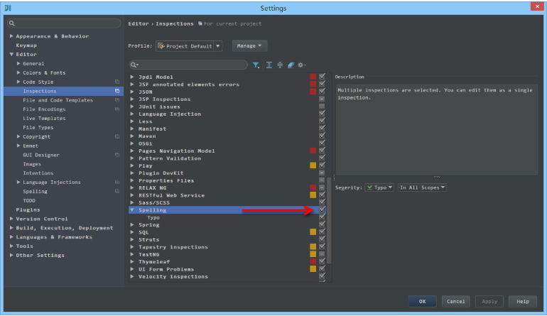

# IDEA

- [IDEA](#idea)
  - [概念](#概念)
  - [核心文件及目录](#核心文件及目录)
  - [配置](#配置)
    - [全局 JDK 配置](#全局-jdk-配置)
    - [Maven](#maven)
      - [常用设置](#常用设置)
      - [Maven 组件界面介绍](#maven-组件界面介绍)
      - [多模块依赖](#多模块依赖)
    - [版本控制 Git/SVN](#版本控制-gitsvn)
    - [调整字体类型和字体大小](#调整字体类型和字体大小)
    - [文件编码](#文件编码)
    - [常用配置](#常用配置)
      - [自动编译](#自动编译)
      - [取消大小写敏感](#取消大小写敏感)
      - [自动导入包](#自动导入包)
      - [代码折叠配置](#代码折叠配置)
      - [开启自动生成serialVersionUID](#开启自动生成serialversionuid)
      - [代码检查等级配置](#代码检查等级配置)
      - [单词拼写检查](#单词拼写检查)
      - [文件类型设置及隐藏特定后缀文件](#文件类型设置及隐藏特定后缀文件)
    - [格式化](#格式化)
    - [实时代码模板](#实时代码模板)
    - [类似 Eclipse 关闭工程](#类似-eclipse-关闭工程)
  - [编译](#编译)
  - [Debug](#debug)
    - [Debug 设置](#debug-设置)
  - [插件](#插件)
    - [Jrebel](#jrebel)
    - [GsonFormat](#gsonformat)
    - [Maven Helper](#maven-helper)
  - [快捷键](#快捷键)
  - [F&Q](#fq)
    - [IDEA 中文光标不跟随](#idea-中文光标不跟随)
    - [Intellij IDEA 运行报 `Command line is too long` 解决办法](#intellij-idea-运行报-command-line-is-too-long-解决办法)

## 概念

IDEA 和 Eclipse 的核心术语比较

|      Eclipse       |     IDEA      |
| :----------------: | :-----------: |
|     Workspace      |    Project    |
|      Project       |    Module     |
|       Facet        |     Facet     |
|       Libray       |    Library    |
|        JRE         |      SDK      |
| Classpath variable | Path variable |

由上表可知，两者最大的转变就在于工作空间概念的转变，并且在IDEA当中，Project 和 Module 是作为两个不同的概念，对项目结构是具有重大意义的。

**IDEA不需要设置工作空间，因为每一个 Project 都具备一个工作空间**。对于每一个 IDEA 项目工程（Project）而言，它的每一个子模块（Module）都可以使用独立的 JDK 和 Maven 配置。这对于传统项目迈向新项目的重构添加了极大的便利性，这种多元化的灵活性正是 Eclipse 所缺失的，因为开始 Eclipse 在初次使用时已经绑死了工作空间。

IDEA的子工程称为 Module，也就是模块化的概念。作为聚合工程或者普通的根目录，它称之为 Project，而下面的子工程称为模块，每一个子模块之间可以相互关联，也可以没有任何关联。

## 核心文件及目录

- **安装目录**

IDEA 安装目录下的 bin 文件夹下，主要文件介绍:

- `idea.exe` 文件是 IntelliJ IDEA 32 位的可行执行文件，IntelliJ IDEA 安装完默认发送到桌面的也就是这个执行文件的快捷方式。
- `idea.exe.vmoptions` 文件是 IntelliJ IDEA 32 位的可执行文件的 VM 配置文件。
- `idea64.exe` 文件是 IntelliJ IDEA 64 位的可行执行文件，要求必须电脑上装有 JDK 64 位版本。64 位的系统也是建议使用该文件。
- `idea64.exe.vmoptions` 文件是 IntelliJ IDEA 64 位的可执行文件的 VM 配置文件。
- `idea.properties` 文件是 IntelliJ IDEA 的一些属性配置文件

- **强烈推荐不要直接修改安装目录下的这几个配置文件，因为 IDEA 升级/重装可能会导致修改完全失效。**
- **强烈推荐使用 IDEA 自带菜单中的 `Help -> Edit Custom VM Options` 和 `Help -> Edit Custom Properties` 来进行参数个性化配置。**

- **设置目录**

不管使用的是哪个操作系统，IntelliJ IDEA 的设置目录命名是统一的、有规律：`.IntelliJIdea2018.3`。其中 `2018.3` 表示大版本号。该文件夹都在当前用户的 Home 目录下。

对于这个设置目录有一个特性，就是删除掉整个目录之后，重新启动 IntelliJ IDEA 会再自动再生成一个全新的默认配置，所以很多时候如果把 IntelliJ IDEA 配置改坏了，删掉该目录，一切都会还原到默认即可。

- `config` 目录是 IntelliJ IDEA 个性化化配置目录，或者说是整个 IDE 设置目录。这个目录主要记录了：IDE 主要配置功能、自定义的代码模板、自定义的文件模板、自定义的快捷键、Project 的 tasks 记录等等个性化的设置。
- `system` 目录是 IntelliJ IDEA 系统文件目录，是 IntelliJ IDEA 与开发项目一个桥梁目录，里面主要有：缓存、索引、容器文件输出等等。

- **属性配置**

注：

- 属性配置是没有32位、64位之分
- 不要直接修改安装目录的bin文件夹下的`idea.properties`，通过`Help -> Edit Custom Properties`修改文件

`idea.config.path=${user.home}/.IntelliJIdea/config`，该属性主要用于指向 IntelliJ IDEA 的个性化配置目录，默认是被注释，打开注释之后才算启用该属性，这里需要特别注意的是斜杠方向，这里用的是正斜杠。【**通过修改 `idea.properties` 中的这个选项配置成云盘地址，可实现多台设置同步化处理**】
`idea.system.path=${user.home}/.IntelliJIdea/system`，该属性主要用于指向 IntelliJ IDEA 的系统文件目录，默认是被注释，打开注释之后才算启用该属性，这里需要特别注意的是斜杠方向，这里用的是正斜杠。如果项目很多，则该目录会很大，且 C 盘空间不够的时候，还是建议把该目录转移到其他盘符下。
`idea.max.intellisense.filesize=2500`，该属性主要用于提高在编辑大文件时候的代码帮助。IntelliJ IDEA 在编辑大文件的时候还是很容易卡顿的。
`idea.cycle.buffer.size=1024`，该属性主要用于控制控制台输出缓存。有遇到一些项目开启很多输出，控制台很快就被刷满了没办法再自动输出后面内容，这种项目建议增大该值或是直接禁用掉，禁用语句 `idea.cycle.buffer.size=disabled`。

## 配置

### 全局 JDK 配置

```File -> Setting -> Project Structure -> SDKs -> JDK```

根据下图设置 JDK 的目录：


注：SDKs 全称是 Software Development Kit，因为 IDEA 支持 JDK 等多种开发工具包。

同理，**当前项目在 Project Structure 可为工程和各模块设置各自的 JDK 版本**。

### Maven

#### 常用设置


- 如上图标注 1 所示，可以指定本地 Maven 的安装目录所在，若已经配置了 `MAVEN_HOME` 系统参数，所以直接这样配置 IntelliJ IDEA 是可以找到的。但是假如没有配置的话，这里可以选择 Maven 安装目录。
- 如上图标注 2 所示，可以指定 Maven 的 `settings.xml` 位置和本地仓库位置。


- 如上图标注 1 所示，`Import Maven projects automatically` 表示 IntelliJ IDEA 会实时监控项目的 pom.xml 文件，进行项目变动设置。
- 如上图标注 2 所示，在 Maven 导入依赖包的时候是否自动下载源码和文档。默认是没有勾选的，也不建议勾选，原因是这样可以加快项目从外网导入依赖包的速度，如果需要源码和文档的时候我们到时候再针对某个依赖包进行联网下载即可。IntelliJ IDEA 支持直接从公网下载源码和文档的。
- 如上图标注 3 所示，可以设置导入的 VM 参数。一般这个都不需要主动改，除非项目真的导入太慢了再增大此参数。

- **设置 maven 自动导入 jar 包**

`File → Other Settings → Default Settings → Importing → Import Maven projects automatically → OK`

#### Maven 组件界面介绍


- 如上图标注 1 所示，为常用的 Maven 工具栏，其中最常用的有：
  - 第一个按钮：`Reimport All Maven Projects` 表示根据 pom.xml 重新载入项目。一般当我们在 pom.xml 添加了依赖包或是插件的时候，发现标注 4 的依赖区中没有看到最新写的依赖的话，可以尝试点击此按钮进行项目的重新载入；
  - 第六个按钮：`Execute Maven Goal` 弹出可执行的 Maven 命令的输入框。有些情况下我们需要通过书写某些执行命令来构建项目，就可以通过此按钮
  - 第九个按钮：`Show Dependencies` 显示项目依赖的结构图，可以方便我们直观项目的依赖包情况。
- 如上图标注 2 所示，常用的 Maven 生命周期的命令，通过双击对应的命令来执行项目编译、打包、部署等操作；
- 如上图标注 3 所示，为在 pom.xml 中配置的插件列表，方便调用插件；
- 如上图标注 4 所示，为在 pom.xml 中配置的依赖包列表；
- 如上图标注 5 所示，为常见的 Java Web 在 Maven 下的一个项目结构。

#### 多模块依赖

- **判断多模块直接是否直接引用工程而非jar包**

`Project Structure -> Modules -> 选中工程 -> Dependencies的Tab标签`


很明显可以看出来，引用项目和直接jar的引用是不同的。

- **方法一**


- 如上图 Gif 所示，这是一个 Maven 多模块项目，在开发多模块的时候，经常会改到其他模块的代码，而模块与模块之间是相互依赖，如果不进行 install 就没办法使用到最新的依赖。所以，为了减少自己手动 install 的过程，可以把 install 过程放在项目启动之前，就像 Gif 所示那样。

- ★★★ **方法二** ★★★


`Resolve Workspace artifacts`勾选中，即可解决依赖工作空间的其他组件未`install`仓库的问题

### 版本控制 Git/SVN

`File -> Other Settings -> Default Settings -> Version Control -> Git`

使用说明： IDEA默认集成了对Git/Svn的支持  直接设置执行程序，右边Test提示成功即可。

### 调整字体类型和字体大小

默认的白色背景和细小的字体会影响大家的编码体验，这里特意提供了调整代码窗的快捷配置。打开配置，搜索Font，然后再Font可以调整字体类型，Size可以调整字体大小，如图：


### 文件编码


- 上图标注 1 所示，IDE 的编码默认是 UTF-8，Project Encoding 虽然默认是 GBK，但是一般建议修改为 UTF-8。
- 上图标注 2 所示，IntelliJ IDEA 可以对 Properties 文件进行专门的编码设置，一般也建议改为 UTF-8，其中有一个重点就是属性 `Transparent native-to-ascii conversion`
- 上图标注 3 所示，对于 Properties 文件，重要属性 `Transparent native-to-ascii conversion` 主要用于转换 ascii，一般都要勾选，不然 Properties 文件中的注释显示的都不会是中文。
- 上图标注 4 所示，IntelliJ IDEA 除了支持对整个 Project 设置编码之外，还支持对目录、文件进行编码设置。如果你要对目录进行编码设置的话，可能会出现需要 Convert 编码的弹出操作选择，

注：<font color="red">在转换之前做好文件备份，不然可能出现转换过程变成乱码，无法还原。</font>

### 常用配置

#### 自动编译

说明：开启自动编译之后，结合Ctrl+Shift+F9 会有热更新效果。[???]


#### 取消大小写敏感

> IntelliJ IDEA 的代码提示和补充功能有一个特性：区分大小写，默认是`First letter`区分大小写。

`File -> Settings -> Editor -> General -> Code Completion -> Math case 不勾选就可以了`

#### 自动导入包


- 如上图标注 1 和 2 所示，默认 IntelliJ IDEA 是没有开启自动 import 包的功能。
  - 勾选标注 1 选项，IntelliJ IDEA 将在我们书写代码的时候自动帮我们优化导入的包，比如自动去掉一些没有用到的包。
  - 勾选标注 2 选项，IntelliJ IDEA 将在我们书写代码的时候自动帮我们导入需要用到的包。但是对于那些同名的包，还是需要手动 Alt + Enter 进行导入的，IntelliJ IDEA 目前还无法智能到替我们做判断。

#### 代码折叠配置


如上图标注红圈所示，我们可以对指定代码类型进行默认折叠或是展开的设置，勾选上的表示该类型的代码在文件被打开的时候默认是被折叠的，去掉勾选则反之。

#### 开启自动生成serialVersionUID


- 默认 IntelliJ IDEA 是没有开启自动帮你生成 serialVersionUID 的，需要我们自行设置。
- 如上图第一张，需要先勾选：`Serializable class without serialVersionUID`
- 如上图第二张，在已经继承了 Serializable 接口的类名上，把光标放在类名上（必须这样做），按 Alt + Enter，即可提示帮你生成 serialVersionUID 功能。

#### 代码检查等级配置


- 如上图 Gif 所示，该功能用来快速设置代码检查等级。我个人一般在编辑大文件的时候会使用该功能。IntelliJ IDEA 对于编辑大文件并没有太大优势，很卡，原因就是它有各种检查，这样是非常耗内存和 CPU 的，所以为了能加快大文件的读写，我一般会暂时性设置为 None。
- Inspections 为最高等级检查，可以检查单词拼写，语法错误，变量使用，方法之间调用等。
- Syntax 可以检查单词拼写，简单语法错误。
- None 不设置检查。

#### 单词拼写检查



- 如上图箭头所示，IntelliJ IDEA 默认是开启单词拼写检查的，有些人可能有强迫症不喜欢看到单词下面有波浪线，就可以去掉该勾选。但是我个人建议这个还是不要关闭，因为拼写检查是一个很好的功能，当大家的命名都是标准话的时候，这可以在不时方便地帮我们找到代码因为拼写错误引起的 Bug。

#### 文件类型设置及隐藏特定后缀文件


- 如上图标注 1 所示，该区域的后缀类型文件在 IntelliJ IDEA 中将以标注 2 的方式进行打开。
- 如上图标注 3 所示，我们可以在 IntelliJ IDEA 中忽略某些后缀的文件或是文件夹，比如我一般会把 .idea 这个文件夹忽略。

### 格式化

TODO

### 实时代码模板

TODO

### 类似 Eclipse 关闭工程


## 编译

相对于 Eclipse 的实时自动编译，IntelliJ IDEA 的编译更加手动化，虽然 IntelliJ IDEA 也可以通过设置开启实时编译，但是太浪费资源了，因此不建议这样做。

IntelliJ IDEA 编译方式除了手工点击编译按钮进行编译之外，还可以在“容器”运行之前配置一个编译事件，先编译后运行。

虽然 IntelliJ IDEA 没有实时编译（未设置时），但是这并不影响代码的自动检查。但是对于多个类之间的关联关系，还是要等Build或Rebuild触发的时候才会做相关检查的。


- **标注 1**：`Build Project`，编译项目；
- **标注 2**：`Build Module`，编译模块；
- **标注 3**：`Recomplie`，重新编译类文件；
- **标注 4**：`Rebuild Project`，重新编译项目。

如上图所示，在 IntelliJ IDEA 中，编译方式有以上 3 种，分别为：

- `Build`：对选定的目标（Project 或 Module）进行编译，但只编译修改过的文件，没有修改过的文件则不会进行编译。
- `Recompile`：对选定的目标（Java 类文件），进行强制性编译，不管目标是否是被修改过。
- `Rebuild`：对选定的目标（Project），进行强制性编译，不管目标是否是被修改过，由于 Rebuild 的目标只有 Project，因此每次 Rebuild 花的时间都比较长。

## Debug

### Debug 设置


- 如上图标注 1 所示，表示设置 Debug 连接方式，默认是 Socket。`Shared memory` 是 Windows 特有的一个属性，一般在 Windows 系统下建议使用此设置，相对于 Socket 会快点。

## 插件

|            插件名称            | 插件介绍                               | 官网地址                                                                    |
| :----------------------------: | -------------------------------------- | --------------------------------------------------------------------------- |
| Alibaba Java Coding Guidelines | 阿里巴巴出的代码规范检查插件           | <https://plugins.jetbrains.com/plugin/10046-alibaba-java-coding-guidelines> |
|          Key promoter          | 快捷键提示                             | <https://plugins.jetbrains.com/plugin/4455?pr=idea>                         |
|      IDE Features Trainer      | IntelliJ IDEA 官方出的学习辅助插件     | <https://plugins.jetbrains.com/plugin/8554?pr=idea>                         |
|         JRebel Plugin          | 热部署                                 | <https://plugins.jetbrains.com/plugin/?id=4441>                             |
|           CodeGlance           | 在编辑代码最右侧，显示一块代码小地图   | <https://plugins.jetbrains.com/plugin/7275?pr=idea>                         |
|           GsonFormat           | 把 JSON 字符串直接实例化成类           | <https://plugins.jetbrains.com/plugin/7654?pr=idea>                         |
|       Markdown Navigator       | 书写 Markdown 文章                     | <https://plugins.jetbrains.com/plugin/7896?pr=idea>                         |
|     Eclipse Code Formatter     | 使用 Eclipse 的代码格式化风格          | <https://plugins.jetbrains.com/plugin/6546?pr=idea>                         |
| Jindent-Source Code Formatter  | 自定义类、方法、doc、变量注释模板      | <http://plugins.jetbrains.com/plugin/2170?pr=idea>                          |
|          Translation           | 翻译插件                               | <https://github.com/YiiGuxing/TranslationPlugin>                            |
|          Maven Helper          | Maven 辅助插件                         | <https://plugins.jetbrains.com/plugin/7179-maven-helper>                    |
|         RestfulToolkit         | 方便查找 SpringMVC 的 RequestMapping   | <https://plugins.jetbrains.com/plugin/10292-restfultoolkit>                 |
|  Properties to YAML Converter  | 把 Properties 的配置格式改为 YAML 格式 | <https://plugins.jetbrains.com/plugin/8000-properties-to-yaml-converter>    |
|        Rainbow Brackets        | 对各个对称括号进行着色，方便查看       | <https://github.com/izhangzhihao/intellij-rainbow-brackets>                 |
|            MybatisX            | mybatis 框架辅助（免费）               | <https://plugins.jetbrains.com/plugin/10119-mybatisx>                       |
|       MyBatis Log Plugin       | Mybatis SQL 提取                       | <https://plugins.jetbrains.com/plugin/10065-mybatis-log-plugin>             |
|         Lombok Plugin          | Lombok 功能辅助插件                    | <https://plugins.jetbrains.com/plugin/6317-lombok-plugin>                   |
|             iedis              | redis客户端                            | <https://plugins.jetbrains.com/plugin/9228-iedis>                           |
|       GenerateAllSetter        | new POJO类的快速生成 set 方法          | <https://plugins.jetbrains.com/plugin/9360-generateallsetter>               |

### Jrebel

[IDEA插件官网](http://plugins.jetbrains.com/)下载所需版本的插件。

使用本地磁盘安装方式来安装Jrebel插件。

修改类后需要重新编译文件，无需重启系统

### GsonFormat

使用快捷键`alt+s`弹出GsonFormat窗口，可进行json格式化

### Maven Helper

一般用这款插件查看 maven 的依赖树

## 快捷键

目前使用Eclipse的键位的快捷键，但是对于Eclipse没有的功能的快捷方式，下表做了记录，如下：

| 快捷键          | 功能                                           |
| --------------- | ---------------------------------------------- |
| `ctrl+shift+u`  | 单词大小写转化                                 |
| `ctrl+shift+f9` | 编译单个文件(Jrebel的热备配合这个快捷键很好用) |
| `alt+insert`    | 快捷get/set                                    |

## F&Q

### IDEA 中文光标不跟随

注：2019年1月24日下载IDEA2018.3.3使用win10自带输入法无此问题


- **解决方法如下**

1. 打开Idea，`ctrl+shift+a`出现的搜索框输入`Switch Boot JDK`
2. 选择JDK版本为自己安装的JDK【不要选择系统自带的JDK】
3. 点击保存并重启

### Intellij IDEA 运行报 `Command line is too long` 解决办法

**报错内容**：

```
Error running 'ServiceStarter': Command line is too long. Shorten command line for ServiceStarter or also for Application default configuration.
```

**解决办法**：

> 修改项目下 `.idea\workspace.xml`，找到标签  `<component name="PropertiesComponent">` ， 在标签里加一行 `<property name="dynamic.classpath" value="true" />`