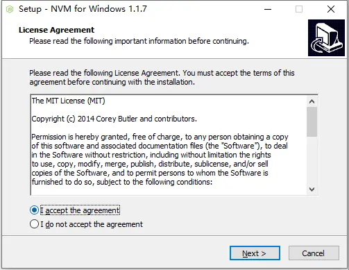
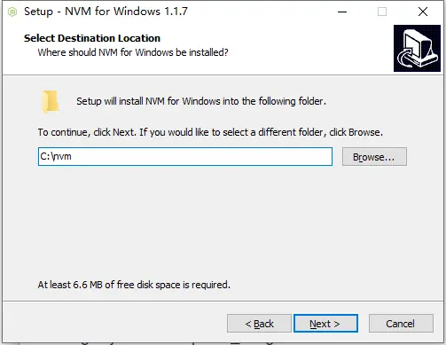
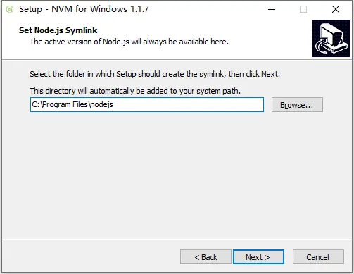
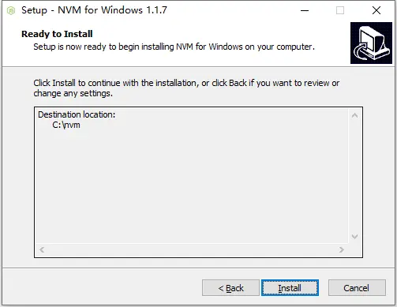
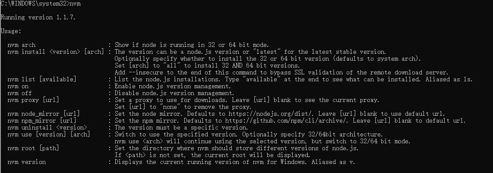

# NVM(node version manager)

## Windows

> 下载地址：<https://github.com/coreybutler/nvm-windows/releases>

### `nvm-setup.exe`

**该安装方式为可视化安装**

1. 执行 `nvm-setup.exe`
   
2. 选择 nvm 安装路径
   
3. 选择 nodejs 安装路径
   
4. 确认安装
   
5. 检查是否安装成功，直接输入 `nvm`，输出如下信息：
   

## Linux

```sh
curl https://raw.githubusercontent.com/creationix/nvm/master/install.sh | bash
```

**验证**

```sh
nvm --version
```

### CentOS7 使用 nvm 安装 nodejs 报错

**错误信息**

```sh
[root@DESKTOP-GVB4Q4E ~]# node -V
node: /lib64/libm.so.6: version `GLIBC_2.27' not found (required by node)
node: /lib64/libc.so.6: version `GLIBC_2.25' not found (required by node)
node: /lib64/libc.so.6: version `GLIBC_2.28' not found (required by node)
node: /lib64/libstdc++.so.6: version `CXXABI_1.3.9' not found (required by node)
node: /lib64/libstdc++.so.6: version `GLIBCXX_3.4.20' not found (required by node)
node: /lib64/libstdc++.so.6: version `GLIBCXX_3.4.21' not found (required by node)
```

**原因**

查看系统内安装的glibc版本

然后再根据分析可得知 新版的node v18开始 都需要 GLIBC_2.27 支持，可是目前系统内却没有那么高的版本

```sh
[root@172 glibc-2.28]# strings /lib64/libc.so.6 |grep GLIBC_
GLIBC_2.2.5
...
GLIBC_2.17
....
```

**解决方案**

> 更新升级 glibc 版本，安装 glibc-2.28

```sh
wget http://ftp.gnu.org/gnu/glibc/glibc-2.28.tar.gz
tar xf glibc-2.28.tar.gz
cd glibc-2.28/

# 必须要建一个空的目录进行编译，不然报如下错误：
# configure: error: you must configure in a separate build directory
mkdir build && cd build

##########make报错########################################################
# configure: error: 
# *** These critical programs are missing or too old: make bison compiler
# *** Check the INSTALL file for required versions.
##########################################################################
## 升级GCC(默认为4 升级为8)
yum install -y centos-release-scl
yum install -y devtoolset-8-gcc*
mv /usr/bin/gcc /usr/bin/gcc-4.8.5
ln -s /opt/rh/devtoolset-8/root/bin/gcc /usr/bin/gcc
mv /usr/bin/g++ /usr/bin/g++-4.8.5
ln -s /opt/rh/devtoolset-8/root/bin/g++ /usr/bin/g++

## 升级 make(默认为3 升级为4)
wget http://ftp.gnu.org/gnu/make/make-4.3.tar.gz
tar -xzvf make-4.3.tar.gz && cd make-4.3/
./configure  --prefix=/usr/local/make
make && make install
cd /usr/bin/ && mv make make.bak
ln -sv /usr/local/make/bin/make /usr/bin/make

##############################LD_LIBRARY_PATH 报错###########################
# configure: error:
# *** LD_LIBRARY_PATH shouldn't contain the current directory when
# *** building glibc. Please change the environment variable
# *** and run configure again.
############################################################################
echo $LD_LIBRARY_PATH
# 删除LD_LIBRARY_PATH变量的内容，执行如下语句
LD_LIBRARY_PATH=

../configure --prefix=/usr --disable-profile --enable-add-ons --with-headers=/usr/include --with-binutils=/usr/bin
make && make install

# 编译安装成功后重新添加 LD_LIBRARY_PATH:
```

## 使用

**显示版本列表**

```sh
nvm list // 显示已安装的版本（同 nvm list installed）
nvm list installed // 显示已安装的版本
nvm list available // 显示所有可以下载的版本
```

**安装指定版本 Node**

```sh
nvm install 14.5.0 // 安装14.5.0版本node
nvm install latest // 安装最新版本node
```

**使用指定版本 Node**

```sh
nvm use 14.5.0 // 使用14.5.0版本node
```

**卸载指定版本 Node**

```sh
nvm uninstall 14.5.0 // 卸载14.5.0版本node
```

**其他命令**

1. `nvm arch` ：显示node是运行在32位还是64位系统上的
2. `nvm on` ：开启nodejs版本管理
3. `nvm off` ：关闭nodejs版本管理
4. `nvm proxy [url]` ：设置下载代理。不加可选参数 url，显示当前代理。将 url设置为 none 则移除代理
5. `nvm node_mirror [url]` ：设置node镜像。默认是 `https://nodejs.org/dist/`。如果不写url，则使用默认url。设置后可至安装目录 `settings.txt` 文件查看，也可直接在该文件操作
6. `nvm npm_mirror [url]` ：设置npm镜像。`https://github.com/npm/cli/archive/`。如果不写url，则使用默认url。设置后可至安装目录 `settings.txt` 文件查看，也可直接在该文件操作
7. `nvm root [path]` ：设置存储不同版本node的目录。如果未设置，默认使用当前目录
8. `nvm version` ：显示 nvm 版本。version 可简化为 v