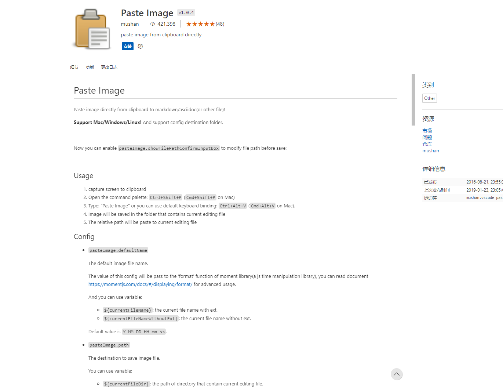

# Paste Image



## 设置图片名称

```json
"pasteImage.defaultName": "${currentFileNameWithoutExt}YMMDDHHmmss"
```

## 设置图片路径是否编码

```json
"pasteImage.encodePath": "none"
```

## 设置图片保存路径

```json
"pasteImage.path": "${currentFileDir}/images",
```