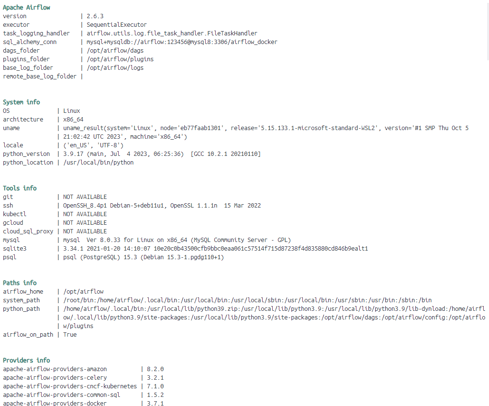

# Airflow

## 命令

**显示当前 Airflow 的信息以及环境信息**

```sh
# 语法
# airflow info [-h] [--anonymize] [--file-io] [-o table, json, yaml, plain] [-v]
airflow info
```



**显示当前 Airflow 版本**

```sh
airflow version
```

```sh
# Dump information about loaded plugins
airflow plugins
```

### `webserver`

> 启动一个 Airflow WebServer 实例

**语法**

```sh
airflow webserver [-h] [-A ACCESS_LOGFILE] [-L ACCESS_LOGFORMAT] [-D] [-d]
                  [-E ERROR_LOGFILE] [-H HOSTNAME] [-l LOG_FILE] [--pid [PID]]
                  [-p PORT] [--ssl-cert SSL_CERT] [--ssl-key SSL_KEY]
                  [--stderr STDERR] [--stdout STDOUT] [-t WORKER_TIMEOUT]
                  [-k {sync,eventlet,gevent,tornado}] [-w WORKERS]
```

**参数**

| 参数                                | 描述                           |
| ----------------------------------- | ------------------------------ |
| `-h`/`--help`                       | 显示帮助信息                   |
| `-p PORT`/`--port PORT`             | 启动 webserver 绑定的端口      |
| `-H HOSTNAME`/`--hostname HOSTNAME` | 启动 webserver 绑定的 hostname |
| `-D`/`--daemon`                     | 以守护进程的方式运行 webserver |
| `-d`/`--debug`                      | 启动 debug 模式                |

**示例**

```sh
airflow webserver --port 8080

# 后端启动
airflow webserver --port 8080 -D &
```

### `config`

> 查看配置

**列出所有配置项**

```sh
airflow config list
```

**打印指定配置项**

```sh
airflow config get-value [-h] [-v] section option
```

### `db`

> 数据库操作

**检查一个数据库是否可以连通**

```sh
airflow db check [-h] [-v]
```

**初始化数据库**

```sh
airflow db init [-h] [-v]
```

### `dags`

> 管理 DAGs

```sh
airflow dags [-h] COMMAND ...
```

**获取 DAGs 列表**

```sh
airflow dags list [-h] [-o table, json, yaml, plain] [-S SUBDIR] [-v]
```

**通过 id 获取 DAG 详细信息**

```sh
airflow dags details [-h] [-o table, json, yaml, plain] [-v] dag_id
```

**获取 DAG 状态**

```sh
airflow dags state [-h] [-S SUBDIR] [-v] dag_id execution_date
```

**触发 DAG 运行**

```sh
airflow dags trigger [-h] [-c CONF] [-e EXEC_DATE] [--no-replace-microseconds]
                     [-o table, json, yaml, plain] [-r RUN_ID] [-S SUBDIR]
                     [-v]
                     dag_id
```

**恢复一个暂停的 DAG**

```sh
airflow dags unpause [-h] [-S SUBDIR] [-v] dag_id
```

### `jobs`

> Manage jobs

### `tasks`

> Manage tasks

### `providers`

> Display providers

### `users`

**创建用户**

```sh
airflow users create \
    --username admin \
    --firstname Peter \
    --lastname Parker \
    --role Admin \
    --email spiderman@superhero.org
```