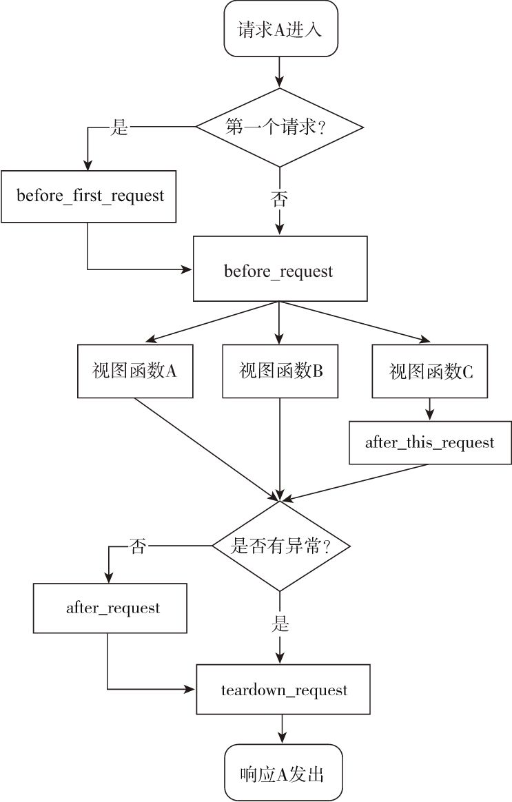

# 请求钩子（Hook）

有时需要对请求进行预处理（preprocessing）和后处理（postprocessing），这时可以使用 Flask 提供的一些请求钩子（Hook），它们可以用来注册在请求处理的不同阶段执行的处理函数（或称为回调函数，即 Callback）。

Flask 默认实现的五种请求钩子，如下所示：

| Hook                   | 说明                                                                                               |
| ---------------------- | -------------------------------------------------------------------------------------------------- |
| `before_first_request` | 在处理第一个请求前运行                                                                             |
| `before_request`       | 在处理每个请求前运行                                                                               |
| `after_request`        | 如果没有未处理的异常抛出，会在每个请求结束后运行                                                   |
| `teardown_request`     | 即使有未处理的异常抛出，会在每个请求结束后运行。如果发生异常，会传入异常对象作为参数到注册的函数中 |
| `after_this_request`   | 在视图函数内注册一个函数，会在这个请求结束后运行                                                   |

