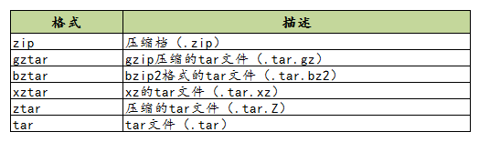

# 打包分发

Python 有非常丰富的第三方库可以使用，很多开发者会向 PyPI 上提交自己的 Python 包。要想向 PyPI 包仓库提交自己开发的包，首先要将自己的代码打包，才能上传分发。

常见的打包工具：

| 工具         | 描述                               |
| ------------ | ---------------------------------- |
| `distutils`  | Python 的一个标准库                |
| `setuptools` | distutils 增强版，不包括在标准库中 |
| `distribute` | setuptools 一个分支版本            |
| `distutils2` | 废弃                               |

## `distutils`

distutils 是标准库中负责建立 Python 第三方库的安装器，使用它能够进行 Python 模块的安装和发布。distutils 对于简单的分发很有用，但功能缺失。大部分 Python 用户会使用更先进的 steptools 模块。

## `distribute`

distribute 是 setuptools 的一个分支。它们共享相同的命名空间，因此如果安装了 distribute，`import setuptools` 时实际上将导入使用 distribute 创建的包。

> **`distribute` 已经合并回 `setuptools`**

## ~~`distutils2`~~

~~`distutils2` 试图尝试充分利用 `distutil`，`setuptools` 和 `distribute` 并成 Python 标准库中的标准工具。但该计划并没有达到预期的目的，且已经是一个废弃的项目。~~

## `setuptools`

> setuptools 是 Python 的一个包管理工具，用于创建、分发和安装 Python 包。它扩展了 Python 标准库中的 distutils，使其更易于使用和扩展，并提供了额外的功能，如自动解决依赖关系和插件系统。

使用 setuptools 可以完成以下任务：

- 创建 Python 包：setuptools 允许用户定义 Python 包的元数据（如包名称、版本、作者、描述等），并提供一个用于构建包的命令行工具 `setup.py`。
- 安装 Python 包：setuptools 提供了一个命令行工具 `easy_install`，可以自动下载和安装 Python 包及其依赖项。另外，setuptools 还可以与其他包管理工具（如 pip）协同工作，以便更好地管理 Python 包的依赖关系。
- 分发 Python 包：setuptools 允许用户将 Python 包发布到 PyPI（Python 包索引）或其他类似的仓库中，以便其他人可以轻松地安装和使用你的包。
- 自动解决依赖关系：setuptools 可以自动解决 Python 包的依赖关系，以确保包及其依赖项都正确地安装和配置。
- 插件系统：setuptools 提供了一个插件系统，允许开发人员编写并安装扩展 setuptools 功能的插件。

> 建议用户通过 `pyproject.toml` 或 `setup.cfg` 以更具声明性的方式公开尽可能多的配置，并仅使用动态部分保持最小化。

### `setup.py` 文件

Python 库打包分发的关键在于编写 `setup.py` 文件。`setup.py` 文件编写的规则是从 setuptools 或者 distuils 模块导入 **setup函数**，并传入各类参数进行调用。

```py
from setuptools import setup
# or
# from distutils.core import setup  

setup(
    name='demo',                                        # 包名字
    version='1.0',                                      # 包版本
    description='This is a test of the setup',          # 简单描述
    author='superz',                                    # 作者
    author_email='zhengchao0555@163.com',               # 作者邮箱
    url='https://superzhc.github.io/SuperzHadoop',      # 包的主页
    packages=['demo'],                                  # 包
)
```

#### 参数概述

`setup` 函数常用的参数如下：([详细见](https://setuptools.pypa.io/en/latest/setuptools.html):<https://setuptools.pypa.io/en/latest/setuptools.html>)

| 参数                 | 说明                                                     |
| -------------------- | -------------------------------------------------------- |
| name                 | 包名称                                                   |
| version              | 包版本                                                   |
| author               | 程序的作者                                               |
| author_email         | 程序的作者的邮箱地址                                     |
| maintainer           | 维护者                                                   |
| maintainer_email     | 维护者的邮箱地址                                         |
| url                  | 程序的官网地址                                           |
| license              | 程序的授权信息                                           |
| description          | 程序的简单描述                                           |
| long_description     | 程序的详细描述                                           |
| platforms            | 程序适用的软件平台列表                                   |
| classifiers          | 程序的所属分类列表                                       |
| keywords             | 程序的关键字列表                                         |
| **包**               |                                                          |
| packages             | 需要处理的包目录(通常为包含 `__init__.py` 的文件夹)      |
| package_dir          | 指定哪些目录下的文件被映射到哪个源码包                   |
| package_data         | 指定包内需要包含的数据文件                               |
| include_package_data | 自动包含包内所有受版本控制(cvs/svn/git)的数据文件        |
| exclude_package_data | 当 include_package_data 为 True 时该选项用于排除部分文件 |
| data_files           | 打包时需要打包的数据文件，如图片，配置文件等             |
| **依赖**             |                                                          |
| install_requires     | 安装时需要安装的依赖包                                   |
| tests_require        | 指定测试时需要使用的依赖                                 |
| extras_require       | 当前包的高级/额外特性需要依赖的分发包                    |
| setup_requires       | 指定运行 setup.py 文件本身所依赖的包                     |
| requires             | 指定依赖的其他包                                         |
| provides             | 指定可以为哪些模块提供依赖                               |
| dependency_links     | 指定依赖包的下载地址                                     |
| **脚本**             |                                                          |
| scripts              | 指定可执行脚本,安装时脚本会被安装到系统 PATH 路径下      |
| entry_points         | 动态发现服务和插件，下面详细讲                           |
| cmdclass             | 添加自定义命令                                           |
| **其他**             |                                                          |
| py_modules           | 需要打包的 Python 单文件列表                             |
| download_url         | 程序的下载地址                                           |
| ext_modules          | 指定扩展模块                                             |
| zip_safe             | 不压缩包，而是以目录的形式安装                           |

#### Python 版本管理：`python_requires`

有些库并不是在所以的 Python 版本中都适用的，若一个库安装在一个未兼容的 Python 环境中，理论上不应该在使用时才报错，而应该在安装过程就使其失败，提示禁止安装。

```py
setup(
    python_requires='>=2.7, <=3',
)
```

#### 源码目录：`find_packages`、`find_namespace_packages`

**`find_packages`**

对于简单工程来说，手动增加 packages 参数是容易。而对于复杂的工程来说，可能添加很多的包，这是手动添加就变得麻烦。Setuptools 模块提供了一个 **`find_packages` 函数**,它默认在与 `setup.py` 文件同一目录下搜索各个含有 `__init__.py` 的目录做为要添加的包。

```py
find_packages(where='.', exclude=(), include=('*',))
```

find_packages 函数的第一个参数用于指定在哪个目录下搜索包，参数 exclude 用于指定排除哪些包，参数 include 指出要包含的包。

默认默认情况下 `setup.py` 文件只在其所在的目录下搜索包。如果不用 find_packages，想要找到其他目录下的包，也可以设置 `package_dir` 参数，其指定哪些目录下的文件被映射到哪个源码包，如: `package_dir={'': 'src'}` 表示 `root package` 中的模块都在 src 目录中。

#### 文件分发：`data_files`、`package_data`、`exclude_package_data`

- `data_files`：打包进包的静态资源，如配置文件、service文件、图片等
- `package_data`：需打包进包的文件
- `exclude_package_data`：排除打包进包的文件

```py
from setuptools import setup

setup(
    data_files=[
        ('', ['conf/*.conf']),
        ('/usr/lib/systemd/system/', ['bin/*.service']),
    ],

    package_data={
        '':['*.txt'],
        'bandwidth_reporter':['*.txt']
    },

    # 启用清单文件MANIFEST.in
    include_package_data=True,

    exclude_package_data={
        'bandwidth_reporter':['*.txt']
    },
)
```

> 除了以上的参数配置之外，还可以使用一个叫做 `MANIFEST.in` 的文件，来控制文件的分发。`MANIFEST.in` 需要放在和 `setup.py` 同级的顶级目录下，setuptools 会自动读取该文件。

#### 依赖包管理：`install_requires`、`setup_requires`、`tests_require`、`dependency_links`、`extras_require`

**`install_requires`**

> 表明当前模块依赖哪些包，若环境中没有，则会从 PyPI 中下载安装

**`setup_requires`**

> `setup.py` 本身要依赖的包，这通常是为一些 setuptools 的插件准备的配置
> 
> 这里列出的包，不会自动安装。

**`tests_require`**

> 仅在测试时需要使用的依赖，在正常发布的代码中是没有用的。
> 
> 在执行 `python setup.py test` 时，可以自动安装这三个库，确保测试的正常运行。

**`dependency_links`**

> 如果其中某些依赖，在官方的 PyPI 中不存在，而是发布在某些私有源中，则需要指定 dependency_links

**`extras_require`**

> extras_require 在安装模块时不会自动安装依赖包，这里仅表示该模块会依赖这些包，但是这些包通常不会使用到，只有当深度使用模块时，才会用到，这里需要用户手动安装

**依赖包的表示方法**

- `argparse`，只包含包名。这种形式只检查包的存在性，不检查版本。 方便，但不利于控制风险。
- `setuptools==38.2.4`，指定版本。这种形式把风险降到了最低，确保了开发、测试与部署的版本一致，不会出现意外。缺点是不利于更新，每次更新都需要改动代码。
- `docutils >= 0.3`，这是比较常用的形式。当对某个库比较信任时，这种形式可以自动保持版本为最新。
- `Django >= 1.11, != 1.11.1, <= 2`，这是比较复杂的形式。如这个例子，保证了 Django 的大版本在 `1.11` 和 `2` 之间，也即 `1.11.x`；并且，排除了已知有问题的版本 `1.11.1`。对于一些大型、复杂的库，这种形式是最合适的。
- `requests[security, socks] >= 2.18.4`，这是包含了额外的可选依赖的形式。 正常安装 requests 会自动安装它的 install_requires 中指定的依赖，而不会安装 security 和 socks 这两组依赖。 这两组依赖是定义在它的 `extras_require` 中。 这种形式，用在深度使用某些库时。

**示例**

```py
from setuptools import setup, find_packages

setup(
    install_requires=['docutils>=0.3'],

    setup_requires=['pbr'],

    tests_require=[
        'pytest>=3.3.1',
        'pytest-cov>=2.5.1',
    ],

    dependency_links=[
        'https://pypi.python.org/simple',
        'http://my.company.com/pypi/',
    ],

    extras_require={
        'PDF': ["ReportLab>=1.2", "RXP"],
        'rest': ["docutils>=0.3"],
    }
)
```

#### 生成可执行分发程序：`entry_points`

> 用来支持自动生成脚本，安装后会自动生成可执行文件

```py
setup(
    # 该模块安装后会自动生成 /usr/bin/foo 的可执行文件，该文件入口指向 foo/main.py 的 main 函数
    entry_points={
        'console_scripts': [
            'foo = foo.main:main'
        ]
    },
)
```

### `setup.py` 命令

| 命令          | 描述                                        |
| ------------- | ------------------------------------------- |
| **标准命令**  |                                             |
| build         | 构建安装所需的全部内容                      |
| clean         | 删除 `build` 命令创建的所有临时文件         |
| install       | 安装源码目录下的全部内容                    |
| sdist         | 创建源码压缩包（以 tar、zip 等格式）         |
| register      | 将程序包注册到 PyPI（Python Package Index） |
| bdist         | 创建二进制包                                |
| bdist_dumb    | 创建 'dumb' 格式的二进制包                  |
| bdist_rpm     | 创建 RPM 格式的二进制包                     |
| bdist_wininst | 创建面向 MS Windows 的安装包                |
| upload        | 将二进制包上传至 PyPI                       |
| check         | 检查程序包的设置值是否正确                  |
| **扩展命令**  |                                             |
| develop       | 以开发模式安装程序包                        |
| setopt        | 在 `setup.cfg` 等文件中记录一个选项         |
| saveopts      | 将给定的多个选项记录在 `setup.cfg` 等文件中 |
| upload_docs   | 向 PyPI 上传文档                            |
| alias         | 定义快捷命令                                |
| bdist_egg     | 创建 `egg` 格式的程序包                     |
| test          | 原地构建后运行 Unit Test                    |

#### install

> 通过源码安装模块

```sh
# 将模块安装至系统全局环境中
python setup.py install
# pip 同等效果的命令
pip install .
```

#### develop

> 以开发模式通过源码安装模块
>
> 开发阶段使用该命令，该命令不会真正的安装包，而是在系统环境中创建一个软链接指向包实际所在目录。这边在修改包之后不用再安装就能生效，便于调试

```py
python setup.py develop
# 如下命令跟上面的命令同等效果
pip install -e .

# pip 开发模式安装支持额外模块依赖包的自动安装
pip install -e ".[dev]"
pip install -e .\[dev\]
```

#### sdist

> 将源码打包成压缩包
>
> 使用 sdist 将根据当前平台创建默认格式的存档。在类 Unix 平台上，将创建后缀后为 `.tar.gz` 的 gzip 压缩的 tar 文件分发包，而在 Windows 上为 ZIP 文件。

```shell
python setup.py sdist
```

用户也可以指定源码发布包的格式：

```shell
# 创建一个压缩的tarball和一个zip文件
python setup.py sdist --formats=gztar,zip
```

可用格式：



#### 构建二进制包：`bdist`、`bdist_dumb`、`bdist_rpm`、`bdist_wininst`、`bdist_egg`

```shell
# Windows exe
python setup.py bdist_wininst

# Linux rpm包
python setup.py bdist_rpm

# egg
python setup.py bdist_egg

# 一次性生成多种格式的二进制发布包
python setup.py bdist
```