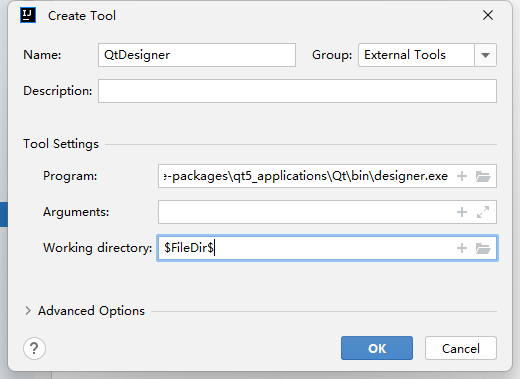
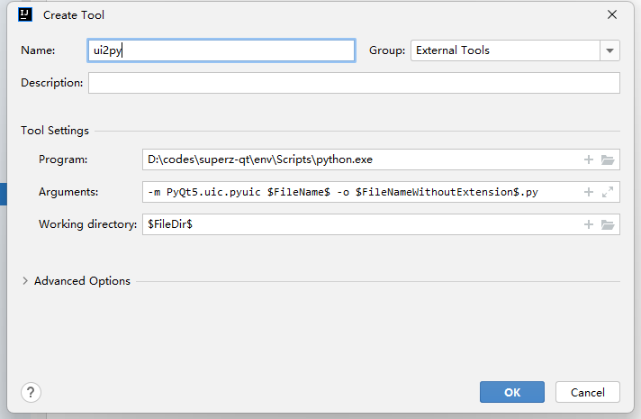
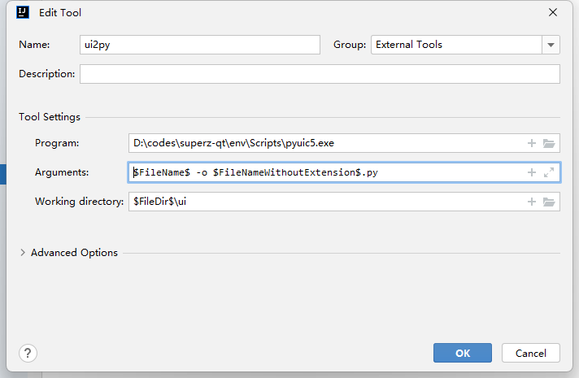
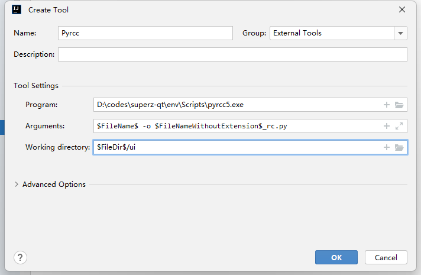
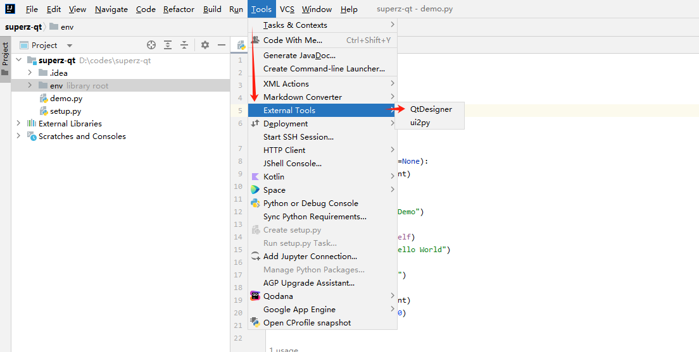
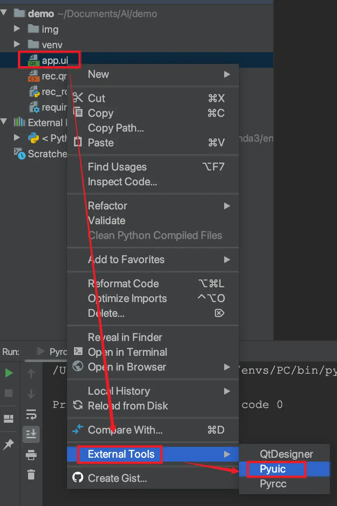

# PyQt5

## 安装

```bash
pip install PyQt5
```

## 开发工具

### 安装开发工具

```bash
pip install PyQt5-tools
```

### 配置

> Qt5 的开发工具在 python 的 `site-packages` 下的 `qt_applications/Qt/bin` 目录下

**配置 QtDesigner**



**配置 Ui 转换为 python 文件**

*方法一*



*方法二*



**配置 Pyrcc**



**使用**



