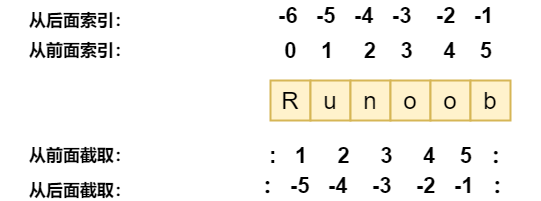

<!--
 * @Github       : https://github.com/superzhc/BigData-A-Question
 * @Author       : SUPERZHC
 * @CreateDate   : 2020-08-25 17:16:43
 * @LastEditTime : 2021-02-20 17:54:31
 * @Copyright 2020 SUPERZHC
-->
# 字符串

Python 的字符串有多种形式，可以使用单引号（`'……'`），双引号（`"……"`）都可以声明。

反斜杠 `\` 可以用来转义。

如果不希望前置了 `\` 的字符转义成特殊字符，可以使用 *原始字符串* 方式，在引号前添加 `r` 即可，如下所示：

```python
r"\ttest"
```

字符串字面值可以跨行连续输入。一种方式是用三重引号：`"""..."""` 或 `'''...'''`。字符串中的回车换行会自动包含到字符串中，如果不想包含，在行尾添加一个 `\` 即可。如下例:

```python
print("""
Usage: thingy [OPTIONS]
     -h                        Display this usage message
     -H hostname               Hostname to connect to
""")
```

<!--
## 截取字符串

Python 中的字符串有两种索引方式，从左往右以 0 开始，从右往左以 -1 开始。

语法：

```py
变量[头下标:尾下标:步长]
```



## 合并（拼接）字符串

Python 使用加号（+）来合并字符串。

```python
first_name = "ada"
last_name = "lovelace"
full_name = first_name + " " + last_name
print(full_name)
# ada lovelace
```

使用星号 * 表示复制当前字符串，与之结合的数字为复制的次数

```py
str = 'Runoob'
print (str * 2)      # 输出字符串两次，也可以写成 print (2 * str)
# RunoobRunoob
```

## 修改字符串首字母的大小写

```python
name = "ada lovelace"
print(name.title())
# Ada Lovelace
```
-->

## 格式化

在 Python 中，字符串格式化使用与 C 中 `sprintf` 函数一样的语法。

```py
print ("我叫 %s 今年 %d 岁!" % ('小明', 10))
```

python 字符串格式化符号:

| 符号  | 描述                                 |
| :---: | ------------------------------------ |
| `%c`  | 格式化字符及其ASCII码                |
| `%s`  | 格式化字符串                         |
| `%d`  | 格式化整数                           |
| `%u`  | 格式化无符号整型                     |
| `%o`  | 格式化无符号八进制数                 |
| `%x`  | 格式化无符号十六进制数               |
| `%X`  | 格式化无符号十六进制数（大写）       |
| `%f`  | 格式化浮点数字，可指定小数点后的精度 |
| `%e`  | 用科学计数法格式化浮点数             |
| `%E`  | 作用同%e，用科学计数法格式化浮点数   |
| `%g`  | `%f` 和 `%e` 的简写                  |
| `%G`  | `%f` 和 `%E` 的简写                  |
| `%p`  | 用十六进制数格式化变量的地址         |

格式化操作符辅助指令:

|  符号   | 功能                                                                                              |
| :-----: | ------------------------------------------------------------------------------------------------- |
|   `*`   | 定义宽度或者小数点精度                                                                            |
|   `-`   | 用做左对齐                                                                                        |
|   `+`   | 在正数前面显示加号( `+` )                                                                         |
| `<sp>`  | 在正数前面显示空格                                                                                |
|   `#`   | 在八进制数前面显示零(`'0'`)，在十六进制前面显示 `'0x'` 或者 `'0X'`(取决于用的是 `'x'` 还是 `'X'`) |
|   `0`   | 显示的数字前面填充 `'0'` 而不是默认的空格                                                         |
|   `%`   | `'%%'` 输出一个单一的 `'%'`                                                                       |
| `(var)` | 映射变量(字典参数)                                                                                |
| `m.n.`  | `m` 是显示的最小总宽度，`n` 是小数点后的位数(如果可用的话)                                        |

### 转换符格式化

转换符格式化 (conversion specifier) 可以引用字典变量。 转换符的格式为 `%(mapping_key)flags`，mapping_key指明引用变量的名称，flags 指明转换格式。

```py
print('%(language)s has %(number)01d quote types.' % {'language': "Python", "number": 2})

>>>
Python has 2 quote types.
```

### format 函数格式化

Python2.6 开始，新增了一种格式化字符串的函数 `str.format()`，它增强了字符串格式化的功能。 基本语法是通过 `{}` 和 `:` 来代替以前的 `%`。format 函数可以接受不限个参数，位置可以不按顺序。

**为格式化参数指定顺序**

```py
print("{} {}".format("abc", "123"))        # 不指定位置，按默认顺序
print("{0} {1}".format("abc", "123"))      # 设置指定位置
print("{1} {0} {1}".format("abc", "123"))  # 设置指定位置

>>>
abc 123
abc 123
123 abc 123
```

**通过名称或索引指定参数**

直接通过名称引用，或者可以通过字典和列表传递参数。

```py
print("name: {name}, age: {age}".format(name="John", age="25"))

# 通过字典设置参数
man = {"name": "John", "age": "25"}
print("name: {name}, age: {age}".format(**man))

# 通过列表索引设置参数
man_list = ['John', '25']
print("name: {0[0]}, age: {0[1]}".format(man_list))  # "0" 是必须的

>>>
name: John, age: 25
name: John, age: 25
name: John, age: 25
```

**直接传递对象**

```py
class testobj(object):
    def __init__(self, value):
        self.value = value
testval = testobj(100)

print('value: {0.value}'.format(testval))  # 只有一个对象，此时 "0" 是可选的

>>>
100
```

**数字格式化**

`str.format()` 提供了强大的数字格式化方法。


