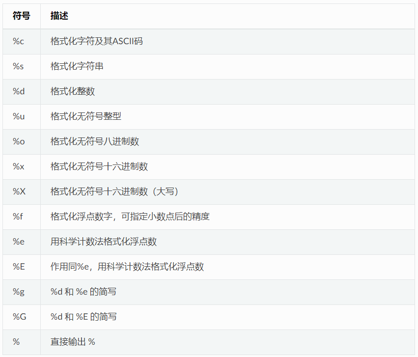
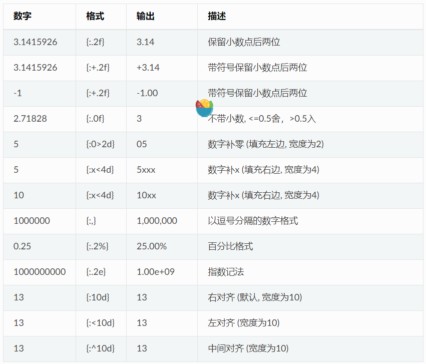

# 字符串格式化

## 常用格式化符号



**示例**

```py
print("%c" % 'a')
print("%s" % "string")
print("%s" % 123)   # 自动调用str()转换为str
print("%d" % 100.0) # 自动调用int()转换为int
print("%u" % 100)
print("%o" % 100)
print("0x%x" % 100)
print("0X%X" % 100)
print("%f" % 100)
print("%e" % 100)
print("%E" % 100)
print("%g" % 100.0)
print("%G" % 100.0)
print("%")         # 直接输出 %，无需 %%

>>>
a
string
123
100
100
144
0x64
0X64
100.000000
1.000000e+02
1.000000E+02
100
100
%
```

## 转换符格式化

转换符格式化 (conversion specifier) 可以引用字典变量。 转换符的格式为 `%(mapping_key)flags`，mapping_key指明引用变量的名称，flags 指明转换格式。

```py
print('%(language)s has %(number)01d quote types.' % {'language': "Python", "number": 2})

>>>
Python has 2 quote types.
```

## format 函数格式化

Python2.6 开始，新增了一种格式化字符串的函数 `str.format()`，它增强了字符串格式化的功能。 基本语法是通过 `{}` 和 `:` 来代替以前的 `%`。format 函数可以接受不限个参数，位置可以不按顺序。

**为格式化参数指定顺序**

```py
print("{} {}".format("abc", "123"))        # 不指定位置，按默认顺序
print("{0} {1}".format("abc", "123"))      # 设置指定位置
print("{1} {0} {1}".format("abc", "123"))  # 设置指定位置

>>>
abc 123
abc 123
123 abc 123
```

**通过名称或索引指定参数**

直接通过名称引用，或者可以通过字典和列表传递参数。

```py
print("name: {name}, age: {age}".format(name="John", age="25"))

# 通过字典设置参数
man = {"name": "John", "age": "25"}
print("name: {name}, age: {age}".format(**man))

# 通过列表索引设置参数
man_list = ['John', '25']
print("name: {0[0]}, age: {0[1]}".format(man_list))  # "0" 是必须的

>>>
name: John, age: 25
name: John, age: 25
name: John, age: 25
```

**直接传递对象**

```py
class testobj(object):
    def __init__(self, value):
        self.value = value
testval = testobj(100)

print('value: {0.value}'.format(testval))  # 只有一个对象，此时 "0" 是可选的

>>>
100
```

**数字格式化**

`str.format()` 提供了强大的数字格式化方法。

