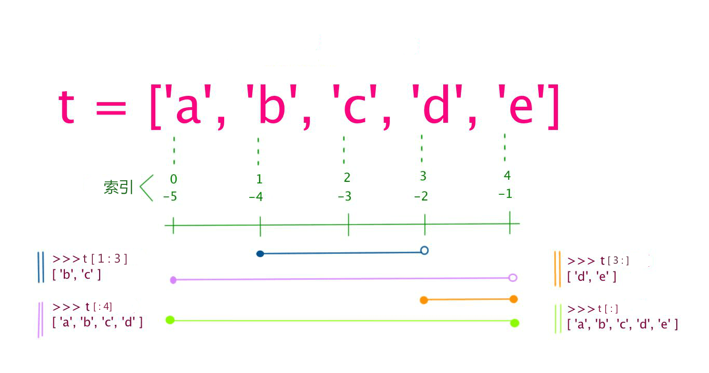

<!--
 * @Github       : https://github.com/superzhc/BigData-A-Question
 * @Author       : SUPERZHC
 * @CreateDate   : 2020-12-25 17:18:27
 * @LastEditTime : 2021-02-20 17:32:22
 * @Copyright 2020 SUPERZHC
-->
# 列表（List）

**列表** 由一系列按特定顺序排列的元素组成。

在 Python 中，用方括号（`[]`）来表示列表，并用逗号来分隔其中的元素。

示例：

```py
bicycles = ["trek", "redline", "specialized"]
print(bicycles)
# ["trek", "redline", "specialized"]
```

## 创建列表

使用 `[]` 或 `list()` 创建列表

## 访问列表元素

列表是有序集合，因此要访问列表的任何元素，只需将该元素的位置或索引告诉 Python 即可。要访问列表元素，可指出列表的名称，再指出元素的索引，并将其放在方括号内。



示例：

```py
bicycles = ["trek", "redline", "specialized"]
print(bicycles[0])
# trek
```

Python 为访问最后一个列表元素提供了一种特殊语法。通过将索引指定为 `-1`，可让 Python 返回最后一个列表元素：

```py
bicycles = ["trek", "redline", "specialized"]
print(bicycles[-1])
# specialized
```

## 修改列表元素

修改列表元素的语法与访问列表元素的语法类似。要修改列表元素，可指定列表名和要修改的元素的索引，再指定该元素的新值。

```py
bicycles = ["trek", "redline", "specialized"]
print(bicycles)
bicycles[0] = "trek2"
print(bicycles)
# ["trek", "redline", "specialized"]
# ["trek2", "redline", "specialized"]
```

## 在列表中添加元素

Python 提供了多种在既有列表中添加新数据的方式。

### 在列表尾部添加元素

在列表中添加新元素时，最简单的方式是将元素附加到列表末尾。给列表附加元素时，它将添加到列表末尾。

```py
bicycles = ["trek", "redline", "specialized"]
print(bicycles)
bicycles.append("trek2")
print(bicycles)
# ["trek", "redline", "specialized"]
# ["trek", "redline", "specialized", "trek2"]
```

### 在列表中插入元素

使用方法 `insert()` 可在列表的任何位置添加新元素。为此，需要指定新元素的索引和值。

```py
bicycles = ["trek", "redline", "specialized"]
print(bicycles)
bicycles.insert(1,"trek2")
print(bicycles)
# ["trek", "redline", "specialized"]
# ["trek", "trek2", "redline", "specialized"]
```

## 从列表中删除元素

### 使用 del 语句删除元素

如果知道要删除的元素在列表中的位置，可使用 del 语句。

```py
bicycles = ["trek", "trek2", "redline", "specialized"]
print(bicycles)
del bicycles[1]
print(bicycles)
# ["trek", "trek2", "redline", "specialized"]
# ["trek", "redline", "specialized"]
```

### 使用方法 `pop()` 删除元素

方法 `pop()` 可删除列表末尾的元素，并获取到删除的元素的值。

```py
bicycles = ["trek", "trek2", "redline", "specialized"]
print(bicycles)
bicycle = bicycles.pop()
print(bicycle)
print(bicycles)
# ["trek", "trek2", "redline", "specialized"]
# specialized
# ["trek", "trek2", "redline"]
```

### 弹出列表中任何位置处的元素

可以使用 `pop()` 来删除列表中任何位置的元素，只需在括号中指定要删除的元素的索引即可。

```py
bicycles = ["trek", "trek2", "redline", "specialized"]
print(bicycles)
bicycles.pop(1)
print(bicycles)
# ["trek", "trek2", "redline", "specialized"]
# ["trek", "redline", "specialized"]
```

## 拼接列表

List可以使用 `+` 操作符进行拼接