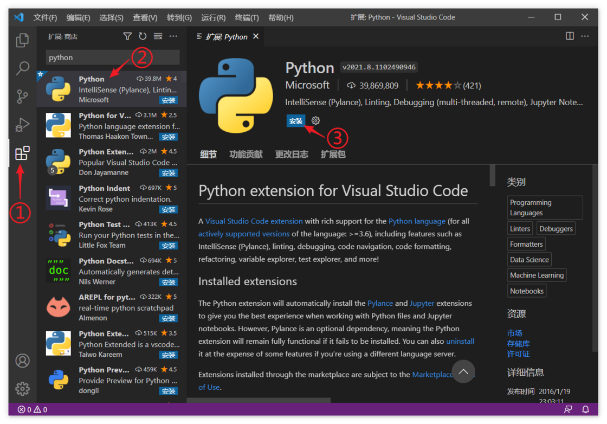
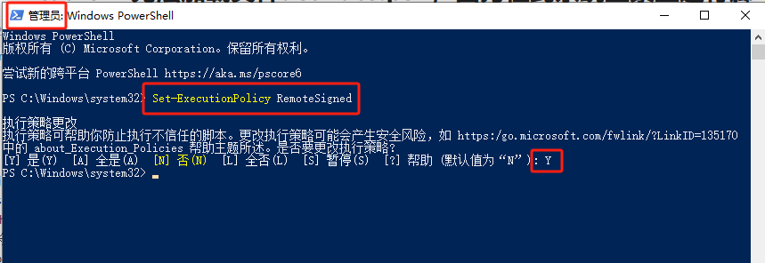

# 开发环境

> Python 3.9.9

## Python 安装

[Python 官网](https://www.python.org/) 下载地址：

- [Windows 版本](https://www.python.org/downloads/windows/)

## IDE

### PyCharm

### VS Code

**Python 插件安装**



**创建虚拟环境并启用**

> 详细见[虚拟环境](虚拟环境.md)

```sh
# 创建虚拟环境
python -m venv venv

# 启用虚拟环境
## Windows
### powershell 环境下
./venv/Scripts/Activate.ps1
# ### cmd 环境下
# ./vevn/Scripts/activate.bat
```

## FAQ

### `.\venv\Scripts\Activate.ps1 : 无法加载文件 xxxx\venv\Scripts\Activate.ps1，因为在此系统上禁止运行脚本`

以管理员身份修改 PowerShell 的策略：`Set-ExecutionPolicy RemoteSigned`

