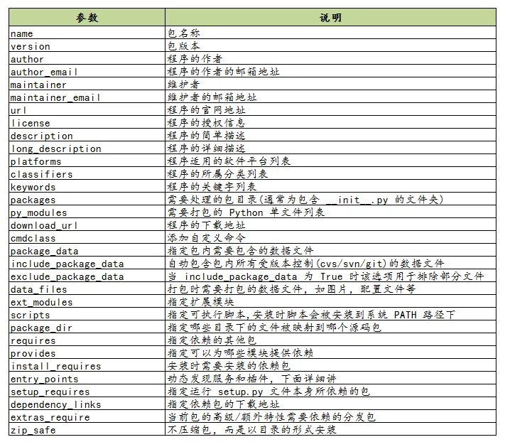

# 打包

项目打包工具

| 工具       | 描述                               |
| ---------- | ---------------------------------- |
| distutils  | Python 的一个标准库                |
| setuptools | distutils 增强版，不包括在标准库中 |
| distribute | setuptools 一个分支版本            |
| distutils2 | 废弃                               |

## 使用 `setup.py` 构建包

### 构建源码发布包

将源码打包成压缩包：

```shell
python setup.py sdist
```

使用 sdist 将根据当前平台创建默认格式的存档。在类 Unix 平台上，将创建后缀后为 `.tar.gz` 的 gzip 压缩的 tar 文件分发包，而在 Windows 上为 ZIP 文件。

用户也可以指定源码发布包的格式：

```shell
# 创建一个压缩的tarball和一个zip文件
python setup.py sdist --formats=gztar,zip
```

可用格式：


### 构建二进制发布包

```shell
# Windows exe
python setup.py bdist_wininst

# Linux rpm包
python setup.py bdist_rpm

# egg
python setup.py bdist_egg

# 一次性生成多种格式的二进制发布包
python setup.py bdist
```

## 使用 `setup.py` 安装包

```shell
# 将模块安装至系统全局环境中
python setup.py install

# 开发阶段使用如下命令，该命令不会真正的安装包，而是在系统环境中创建一个软链接指向包实际所在目录。这边在修改包之后不用再安装就能生效，便于调试
pip install -e .
## OR
python setup.py develop
```

## `setup.py`

**示例**

```py
from setuptools import setup, find_packages

setup(
    name="demo",
    version="1.0",
    author="superz",
    author_email="zhengchao0555@163.com",

    # 项目主页
    url="https://superzhc.github.io/SuperzHadoop",

    # 你要安装的包，通过 setuptools.find_packages 找到当前目录下有哪些包
    packages=find_packages()
)
```

**选项**

> 下图只罗列了部分选项，详细见：<https://setuptools.pypa.io/en/latest/setuptools.html>



**Python版本管理**

有些库并不是在所以的 Python 版本中都适用的，若一个库安装在一个未兼容的 Python 环境中，理论上不应该在使用时才报错，而应该在安装过程就使其失败，提示禁止安装。

```py
setup(
    python_requires='>=2.7, <=3',
)
```

**文件分发**

```py
from setuptools import setup

setup(
    # 安装过程中，需要安装的静态文件，如配置文件、service文件、图片等
    data_files=[
        ('', ['conf/*.conf']),
        ('/usr/lib/systemd/system/', ['bin/*.service']),
               ],

    # 希望被打包的文件
    package_data={
        '':['*.txt'],
        'bandwidth_reporter':['*.txt']
               },
    # 不打包某些文件
    exclude_package_data={
        'bandwidth_reporter':['*.txt']
               }
)
```

除了以上的参数配置之外，还可以使用一个叫做 `MANIFEST.in` 的文件，来控制文件的分发。`MANIFEST.in` 需要放在和 `setup.py` 同级的顶级目录下，setuptools 会自动读取该文件。

**依赖包管理**

```py
from setuptools import setup, find_packages

setup(
    # 表明当前模块依赖哪些包，若环境中没有，则会从pypi中下载安装
    install_requires=['docutils>=0.3'],

    # setup.py 本身要依赖的包，这通常是为一些setuptools的插件准备的配置
    # 这里列出的包，不会自动安装。
    setup_requires=['pbr'],

    # 仅在测试时需要使用的依赖，在正常发布的代码中是没有用的。
    # 在执行python setup.py test时，可以自动安装这三个库，确保测试的正常运行。
    tests_require=[
        'pytest>=3.3.1',
        'pytest-cov>=2.5.1',
    ],

    # 用于安装setup_requires或tests_require里的软件包
    # 这些信息会写入egg的 metadata 信息中
    dependency_links=[
        "http://example2.com/p/foobar-1.0.tar.gz",
    ],

    # install_requires 在安装模块时会自动安装依赖包
    # 而 extras_require 不会，这里仅表示该模块会依赖这些包
    # 但是这些包通常不会使用到，只有当你深度使用模块时，才会用到，这里需要你手动安装
    extras_require={
        'PDF':  ["ReportLab>=1.2", "RXP"],
        'reST': ["docutils>=0.3"],
    }
)
```

关于 install_requires， 有以下五种常用的表示方法：

- `argparse`，只包含包名。这种形式只检查包的存在性，不检查版本。 方便，但不利于控制风险。
- `setuptools==38.2.4`，指定版本。这种形式把风险降到了最低，确保了开发、测试与部署的版本一致，不会出现意外。缺点是不利于更新，每次更新都需要改动代码。
- `docutils >= 0.3`，这是比较常用的形式。当对某个库比较信任时，这种形式可以自动保持版本为最新。
- `Django >= 1.11, != 1.11.1, <= 2`，这是比较复杂的形式。如这个例子，保证了 Django 的大版本在 `1.11` 和 `2` 之间，也即 `1.11.x`；并且，排除了已知有问题的版本 `1.11.1`。对于一些大型、复杂的库，这种形式是最合适的。
- `requests[security, socks] >= 2.18.4`，这是包含了额外的可选依赖的形式。 正常安装 requests 会自动安装它的 install_requires 中指定的依赖，而不会安装 security 和 socks 这两组依赖。 这两组依赖是定义在它的 `extras_require` 中。 这种形式，用在深度使用某些库时。

**生成可执行分发程序**

```py
setup(
    # 用来支持自动生成脚本，安装后会自动生成 /usr/bin/foo 的可执行文件
    # 该文件入口指向 foo/main.py 的 main 函数
    entry_points={
        'console_scripts': [
            'foo = foo.main:main'
        ]
    },
)
```