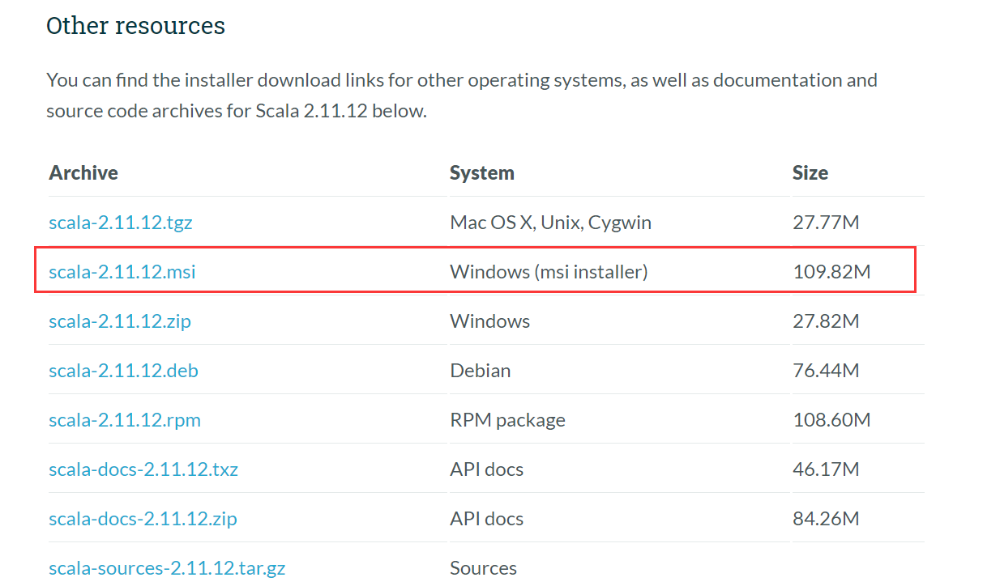
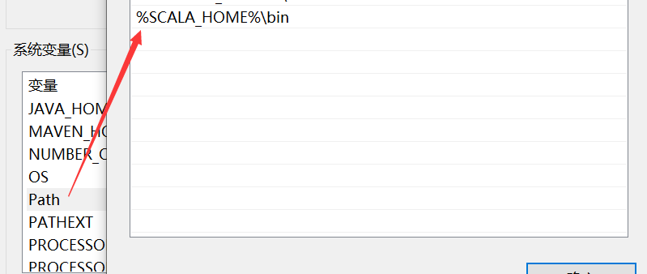

# Scala 安装配置

> Scala 官网地址：<https://www.scala-lang.org/download/>

注：针对大数据，一般选择 Scala 的 2.11 版本

## Windows 安装

选择如下的 Windows 安装包

下载后，双击 msi 文件，一步步安装即可，安装过程可以使用默认的安装目录。

安装好 scala 后，系统会自动提示，单击 finish，完成安装。

> 注：默认安装的情况下，scala 的环境变量已经配置好了。若没有配置，需要设置 Scala 的环境变量。如下所示：
> 
> 

