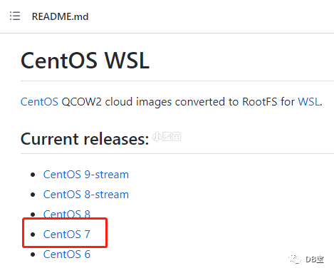
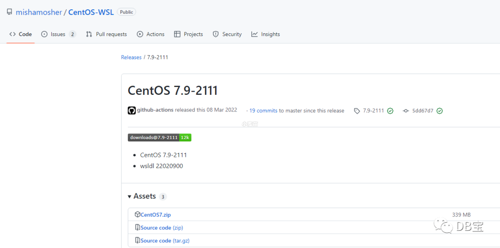

# CentOS 子系统

## 安装[docker镜像导入 Linux 发行版]

> 参考官网：<https://learn.microsoft.com/zh-cn/windows/wsl/use-custom-distro>
> 
> 2023-04-27：当前微软官网没有提供 CentOS 子系统


> **前提**：Windows 系统已经安装了 Docker，启动指定 CentOS 版本的容器。

### 1. 将容器导出 tar 文件

```shell
# docker export $dockerContainerID > /mnt/c/temp/centos.tar
docker export fc13b9ca8885 > E://wsl/centos7.tar
```

### 2. 将 tar 文件导入 WSL

```shell
# wsl --import <Distro> <InstallLocation> <FileName>
wsl --import CentOS7 E:\wsl\CentOS7 E:\wsl\centos7.tar
# 未成功，不知道是公司的加密软件的问题还是不能从Windows导出，待验证
```

## 安装[通过github开源包直接导入]

> 参考地址： https://www.how2shout.com/how-to/install-centos-on-windows-10-subsystem-for-linux.html

以下是 Github 上的一个开源项目，提供适用于 Linux 的 Windows 子系统的 CentOS 的下载。

访问地址： <https://github.com/mishamosher/CentOS-WSL>





1. 解压镜像包后，得到以下两个文件分别是：`rootfs.tar.gz`, `CentOS.exe`
2. 安装运行，右键 `CentOS.exe` 文件， 以管理员身份运行
3. 安装完成后，将在 CentOS 命令屏幕上收到一条消息。现在按 Enter 键退出设置
4. 运行 CentOS 7
    - 一种是：在安装目录中找到 `CentOS7.exe` 双击运行，进入到 linux 系统
    - 另一种：在 cmd 中 输入 wsl，进入到 linux 系统

要卸载它，请将 PowerShell 作为管理员切换到 CentOS 目录， `./CentOS.exe clean`