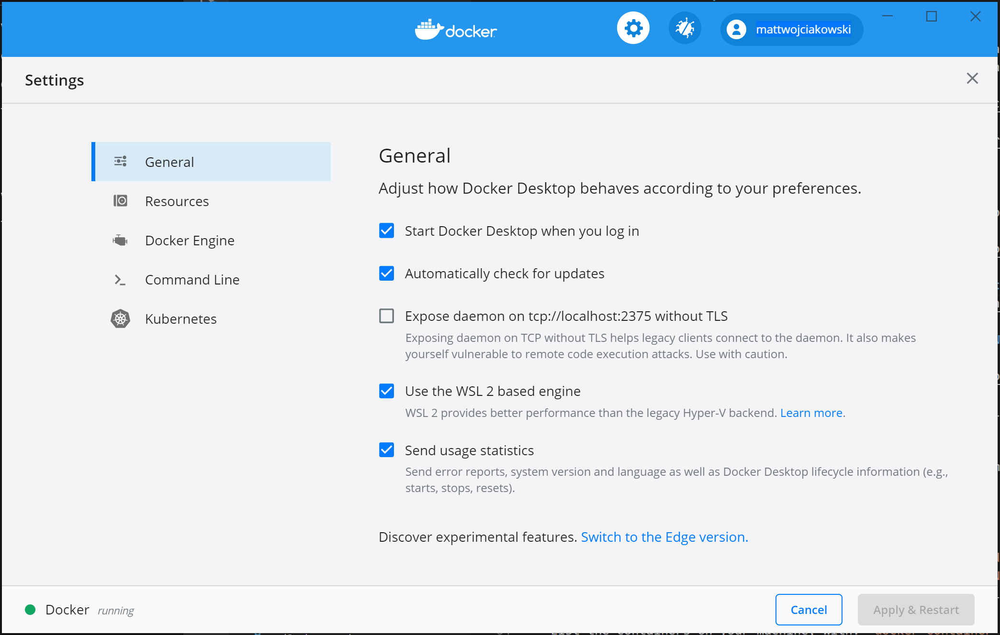
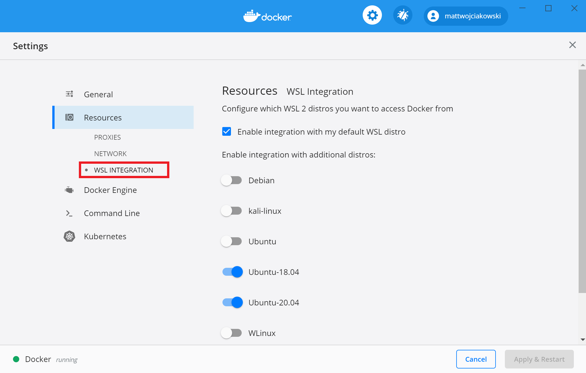

# Docker

## 将 Docker Desktop(Windows 版本) 集成到 WSL2

> 官网地址：<https://learn.microsoft.com/zh-CN/windows/wsl/tutorials/wsl-containers>

1. 确保在“设置”>“常规”中选中“使用基于 WSL 2 的引擎”
   
2. 通过转到“设置”>“资源”>“WSL 集成”，从要启用 Docker 集成的已安装 WSL 2 发行版中进行选择
   

进入 WSL 对应的发行版本，通过输入 `docker --version` 来显示版本和内部版本号