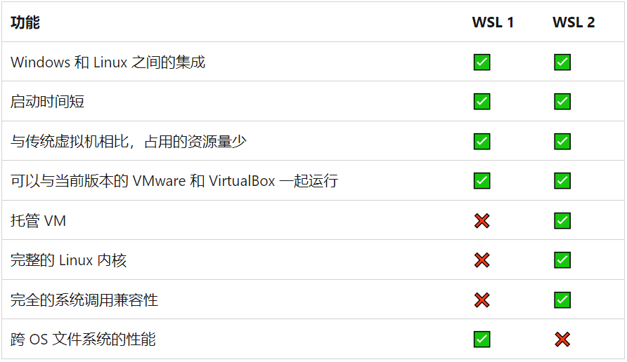

# WSL/WSL 2

> WSL 是适用于 Linux 的 Windows 子系统可让开发人员按原样运行 GNU/Linux 环境 - 包括大多数命令行工具、实用工具和应用程序 - 且不会产生传统虚拟机或双启动设置开销。

> WSL 2 是适用于 Linux 的 Windows 子系统体系结构的一个新版本，它支持适用于 Linux 的 Windows 子系统在 Windows 上运行 ELF64 Linux 二进制文件。 它的主要目标是提高文件系统性能，以及添加完全的系统调用兼容性。



## 安装

> 前提：下列的操作都是在管理员权限下的命令行界面运行的

```shell
wsl --install
```

执行上述命令后需 **重启** 系统。

### 安装指定发行版

**查看可用发行版列表**

```shell
wsl --list --online
# 简写如下：
wsl -l -o
```

**安装发行版**

```shell
wsl --install -d <DistroName>
```

## 命令

**列出已安装的 Linux 发行版**

```shell
wsl --list --verbose
# 简写如下：
wsl -l -v
```

**运行特定的 Linux 发行版**

```shell
# <DistributionName>：发行版的名称
# wsl -d <DistributionName>
wsl -d Ubuntu
```

**停止特定的 Linux 发行版**

```shell
wsl --terminate Ubuntu
```

**设置新安装 Linux 发行版的 WSL 默认版本**

```shell
# <Version#> 可选值为 1 或 2
# wsl --set-default-version <Version#>
wsl --set-default-version 2
```

**修改指定 Linux 发行版的 WSL 版本**

```shell
# wsl --set-version <distribution name> <versionNumber>
# 示例：将 Ubuntu 20.04 发行版设置为使用 WSL 2
wsl --set-version Ubuntu-20.04 2
```

## Linux 发行版所在 Windows 中的文件位置

```bash
# \\wsl$\<DistroName>\home\<UserName>\Project
\\wsl$
```

## 迁移 Linux 发行版数据盘

**停止实例**

```shell
wsl --terminate Ubuntu
```

**实例备份导出**

```shell
wsl --export Ubuntu E:\wsl\Ubuntu_export.tar
```

**注销现有实例**

```shell
wsl --unregister Ubuntu
```

**导入实例并指定存放虚拟磁盘镜像文件的路径**

```shell
wsl --import Ubuntu E:\wsl\Ubuntu E:\wsl\Ubuntu_export.tar --version 2
```

**设置默认使用用户【可选】**

> 若未设置默认 WSL 使用用户，默认是使用 root 来登录

```shell
ubuntu.exe config --default-user superz
```